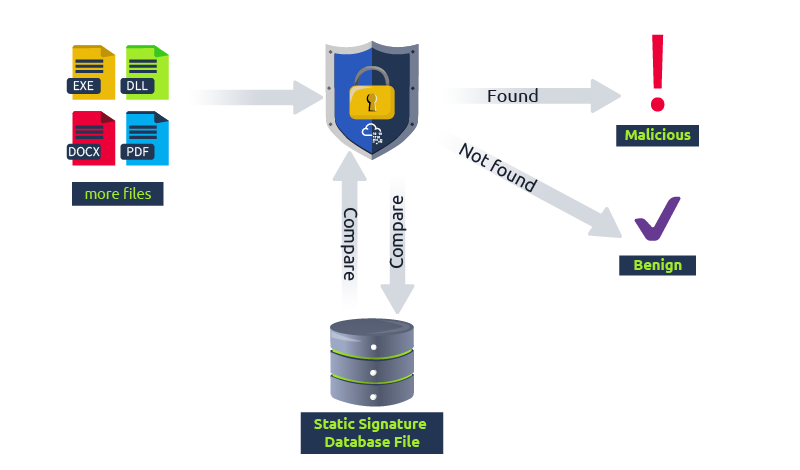
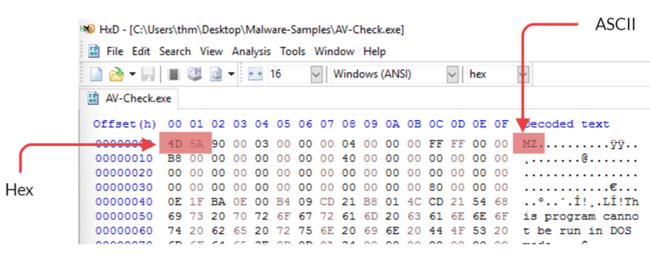
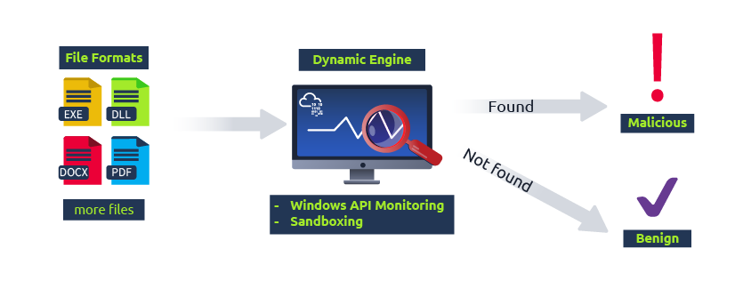
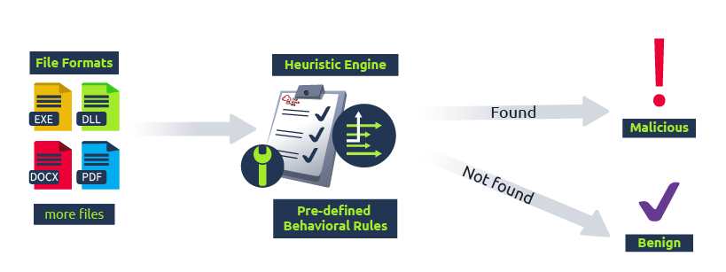
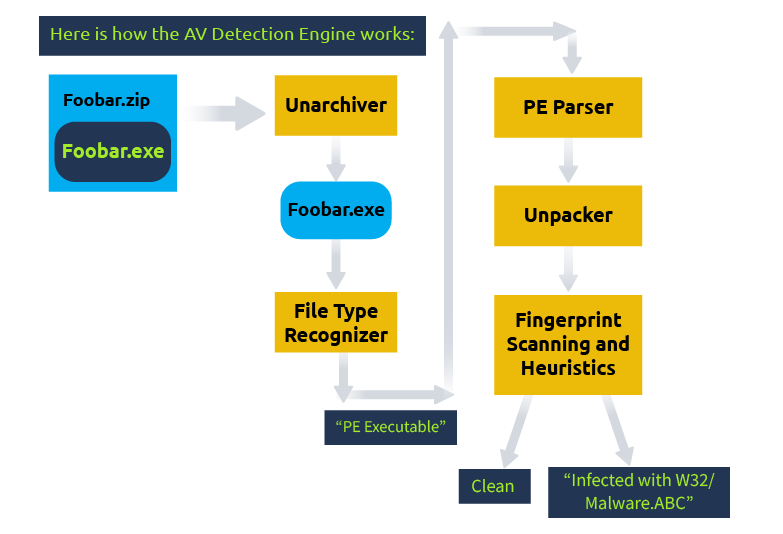
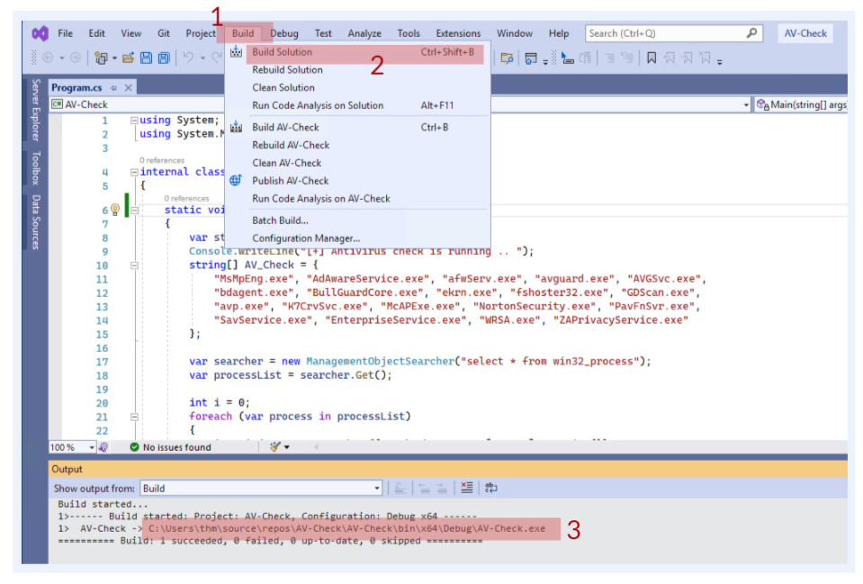
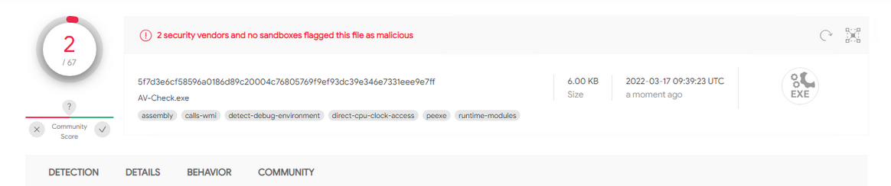
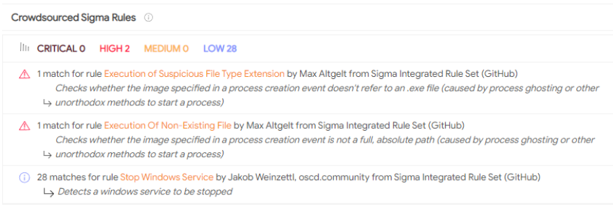
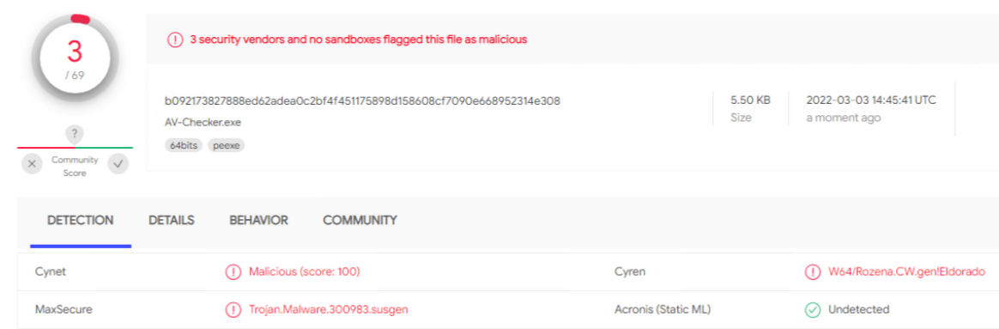

# Introduction to Antivirus - 防病毒简介

> [TryHackMe | Introduction to Antivirus](https://tryhackme.com/room/introtoav)
>
> Updated in 2023-12-31
>
> 了解防病毒软件的工作原理以及用于规避恶意文件检查的检测技术。
>
> Understand how antivirus software works and what detection techniques are used to bypass malicious file checks.

## Introduction - 简介

### 欢迎来到防病毒简介

防病毒（AV）软件是最重要的基于主机的安全解决方案之一，用于检测和阻止终端用户计算机中的恶意软件攻击。AV 软件包括不同的模块、功能和检测技术，本文将对其进行讨论。

作为红队人员或渗透测试者，熟悉并了解 AV 软件及其检测技术是至关重要的。一旦掌握了这些知识，就更容易研究 AV 规避技术。

### 学习目标

- 什么是防病毒软件？
- 防病毒检测方法
- 列举目标机器上安装的防病毒软件
- 在模拟环境中进行测试

### 房间前置条件

房间先决条件：

- 对基于主机的检测解决方案有一般了解；查看 `The Lay of the Land` 房间获取更多信息。
- 具备哈希加密的一般经验；查看 `Hashing - Crypto 101` 房间获取更多信息。
- 基本了解 Yara 规则；查看 THM  `Hashing - Crypto 101` 房间获取更多信息。

## Antivirus Software - 防病毒软件

### 什么是 AV 软件

防病毒（AV）软件是一层额外的安全保障，旨在检测和阻止恶意文件在目标操作系统中的执行和传播。

它是一种基于主机的应用程序，在实时（在后台）运行，监视和检查当前以及新下载的文件。AV 软件使用不同的技术检查文件，决定其是否恶意，这些技术将在本房间后续讨论。

有趣的是，最早的防病毒软件仅设计用于检测和清除计算机病毒。如今情况已有所改变；现代防病毒应用程序不仅可以检测和清除 [计算机病毒](https://malware-history.fandom.com/wiki/Virus) ，还能识别和清除其他有害文件和威胁。

### AV 软件寻找什么？

传统的 AV 软件寻找预先定义的恶意模式或签名的恶意软件。恶意软件是指其主要目标是对目标计算机造成损害的有害软件，其中包括但不限于：

- 获取对目标机器的完全访问权限。
- 窃取诸如密码之类的敏感信息。
- 加密文件并对文件造成损害。
- 注入其他恶意软件或不需要的广告。
- 利用受损机器执行进一步的攻击，如僵尸网络攻击。

### AV 与其他安全产品

除了 AV 软件外，其他基于主机的安全解决方案也为终端设备提供实时保护。终端检测与响应（EDR）是一种安全解决方案，基于行为分析提供实时保护。防病毒应用程序进行扫描、检测和清除恶意文件。另一方面，EDR 监控目标计算机中的各种安全检查，包括文件活动、内存、网络连接、Windows 注册表、进程等。

现代防病毒产品实现了将传统防病毒功能和其他高级功能（类似于 EDR 功能）整合到一个产品中，以全面抵御数字威胁。有关基于主机的安全解决方案的更多信息，建议访问 THM 房间：`The Lay of the Land` 。

### AV 软件的过去和当下

迈克菲公司于 1987 年推出了第一个 AV 软件实现，名为 “VirusScan”，当时主要目标是清除感染了约翰 · 麦卡菲电脑的病毒 “Brain”。随后，其他公司也加入了对抗病毒的战斗。AV 软件被称为扫描器，它们是命令行软件，用于在文件中搜索恶意模式。

从那时起，情况已经改变。现代 AV 软件使用图形用户界面（GUI）执行恶意文件扫描和其他任务。恶意软件程序的范围也扩大了，现在瞄准 Windows 和其他操作系统的受害者。现代 AV 软件支持大多数设备和平台，包括 Windows、Linux、macOS、Android 和 iOS。现代 AV 软件已经改进并变得更加智能和复杂，因为它们拥有一系列多功能特性，包括防病毒、防利用漏洞、防火墙、加密工具等。

我们将在下一个任务中讨论一些 AV 功能。

:::info Answer the questions below

AV 是什么意思?

```plaintext
Antivirus
```

哪家 PC 防病毒供应商实施了市场上第一个 AV 软件？

```plaintext
McAfee
```

防病毒软件是一种基于 _____ 的安全解决方案。

```plaintext
host
```

:::

## Antivirus Features - 防病毒功能

### Antivirus Engines - 防病毒引擎

AV 引擎负责查找并清除恶意代码和文件。优秀的 AV 软件实现了一个高效坚固的 AV 核心，能够准确快速地分析恶意文件。此外，它应该处理并支持各种文件类型，包括存档文件，在这些文件中可以自行解压并检查所有压缩文件。

大多数 AV 产品共享相同的常见功能，但实现方式有所不同，包括但不限于：

- 扫描器
- 检测技术
- 压缩文件和存档
- 解包器
- 模拟器

### Scanner - 扫描器

大多数 AV 产品都包含扫描器功能：AV 软件可以实时或按需运行和扫描。此功能可通过 GUI 或命令提示符使用。用户可以根据需要随时检查文件或目录。扫描功能必须支持最常见的恶意文件类型，以便检测和清除威胁。此外，根据 AV 软件的不同，它还可能支持其他类型的扫描，包括漏洞、电子邮件、Windows 内存和 Windows 注册表等。

### Detection techniques - 检测技术

AV 检测技术用于搜索和检测恶意文件；AV 引擎内部可以使用不同的检测技术，包括：

- 基于签名的检测是传统的 AV 技术，寻找文件中预定义的恶意模式和签名。
- 启发式检测是一种更高级的技术，包括各种行为方法来分析可疑文件。
- 动态检测是一种技术，包括监视系统调用和 API，并在隔离环境中进行测试和分析。

我们将在下一个任务中详细介绍这些技术。优秀的 AV 引擎能够准确快速地检测到恶意文件，并减少虚警结果。我们将展示几种 AV 产品，它们提供了不准确的结果，并对文件进行了错误分类。

### Compressors and Archives - 压缩器和档案

“压缩文件和存档” 功能应该包含在任何 AV 软件中。它必须支持并能处理各种系统文件类型，包括压缩或归档文件：ZIP、TGZ、7z、XAR、RAR 等。恶意代码通常试图通过隐藏在压缩文件中来逃避基于主机的安全解决方案。因此，AV 软件必须在用户打开存档文件中的文件之前对其进行解压缩并进行全面扫描。

### PE (Portable Executable) Parsing and Unpackers - PE （可移植可执行文件）解析和解包程序

恶意软件通过在有效载荷内部压缩和加密其恶意代码来进行隐藏和打包。它在运行时解压缩和解密，以增加静态分析的难度。因此，AV 软件必须能够在运行时之前检测和解包大多数已知的打包工具（如 UPX、Armadillo、ASPack 等），以进行静态分析。

恶意软件开发人员使用各种技术（如打包）来缩小文件大小并改变恶意文件的结构。打包将原始可执行文件压缩，使其更难以分析。因此，AV 软件必须具有解包功能，以将受保护或压缩的可执行文件解压缩为原始代码。

AV 软件必须具有的另一个功能是 Windows 可执行文件（PE）头部解析器。解析可执行文件的 PE 有助于区分恶意和合法软件（.exe 文件）。Windows 中的 PE 文件格式（32 位和 64 位）包含各种信息和资源，如目标代码、DLL、图标文件、字体文件和核心转储。

### Emulators - 模拟器

模拟器是防病毒软件的一个特性，它对可疑文件进行进一步分析。一旦模拟器接收到请求，它会在虚拟化和受控的环境中运行可疑文件（exe、DLL、PDF 等）。它监视可执行文件在执行过程中的行为，包括 Windows API 调用、注册表和其他 Windows 文件。以下是模拟器可能收集的一些示例产物：

- API 调用
- 内存转储
- 文件系统修改
- 日志事件
- 运行中的进程
- 网络请求

当收集到足够的产物来检测恶意软件时，模拟器会停止文件的执行。

### 其他共同特征

以下是一些常见于 AV 产品中的功能：

- 自我保护驱动，用于防范恶意软件攻击实际的 AV
- 防火墙和网络检查功能
- 命令行和图形界面工具
- 守护进程或服务
- 管理控制台

:::info Answer the questions below

哪种反病毒功能可以在安全且隔离的环境中分析恶意软件？

```plaintext
Emulators
```

_______ 功能是将压缩的可执行文件恢复或解密为原始文件的过程

```plaintext
Unpackers
```

:::

## Deploy the VM - 部署虚拟机

部署一个远程靶机

```plaintext
Machine IP: 10.10.137.106
Username: thm
Password: TryHackM3
```

## AV Static Detection - AV 静态检测

一般来说，AV 检测可以分为三种主要方法：

- 静态检测
- 动态检测
- 启发式和行为检测

### Static Detection - 静态检测

静态检测技术是防病毒检测中最简单的一种，它基于恶意文件的预定义签名。它使用模式匹配技术进行检测，比如查找独特字符串、CRC（校验和）、字节码 / 十六进制值序列和密码散列（MD5、SHA1 等）。

然后它在操作系统中的现有文件与签名数据库之间进行一系列比较。如果签名在数据库中存在，那么就被视为恶意。这种方法对静态恶意软件有效。

<div style={{textAlign:'center'}}>



</div>

在这项任务中，我们将使用基于签名的检测方法来查看防病毒产品如何检测恶意文件。需要注意的是，这种技术仅适用于已知恶意文件，前提是数据库中预先生成了相应的签名。因此，数据库需要定期更新。

我们将使用 `ClamAV` 防病毒软件演示基于签名的检测是如何识别恶意文件的。ClamAV 软件预先安装在提供的虚拟机中，我们可以在以下路径访问它：`c:\Program Files\ClamAV\clamscan.exe` 。我们还将扫描几个恶意软件样本，这些样本可以在桌面上找到。恶意软件样本文件夹包含以下文件：

- EICAR 是一个测试文件，其中包含用于测试防病毒软件有效性的 ASCII 字符串，而不是真正可能损坏您计算机的恶意软件。欲了解更多信息，请访问官方 [Download Anti Malware Testfile - EICAR](https://www.eicar.org/download-anti-malware-testfile/) 。
- Backdoor 1 是一个 C# 程序，使用一个众所周知的技术建立一个反向连接，包括创建一个进程并执行 Metasploit Framework 的 shellcode。
- Backdoor 2 是一个 C# 程序，使用进程注入和加密来建立一个反向连接，包括将 Metasploit 的 shellcode 注入到一个现有且正在运行的进程中。
- AV-Check 是一个 C# 程序，在目标计算机上列举防病毒软件。请注意，该文件并非恶意。我们将在第 6 项任务中更详细地讨论这个工具。
- notes.txt 是一个文本文件，其中包含一个命令行。请注意，该文件并非恶意。

ClamAV 自带其数据库，在安装过程中，我们需要下载最近更新的版本。让我们尝试使用 clamscan.exe 二进制文件扫描恶意软件样本文件夹，看看 ClamAV 对这些样本的表现如何。

```shell title="Command Prompt"
c:\>"c:\Program Files\ClamAV\clamscan.exe" c:\Users\thm\Desktop\Samples
Loading:    22s, ETA:   0s [========================>]    8.61M/8.61M sigs
Compiling:   4s, ETA:   0s [========================>]       41/41 tasks

C:\Users\thm\Desktop\Samples\AV-Check.exe: OK
C:\Users\thm\Desktop\Samples\backdoor1.exe: Win.Malware.Swrort-9872015-0 FOUND
C:\Users\thm\Desktop\Samples\backdoor2.exe: OK
C:\Users\thm\Desktop\Samples\eicar.com: Win.Test.EICAR_HDB-1 FOUND
C:\Users\thm\Desktop\Samples\notes.txt: OK
```

上述输出显示，ClamAV 软件正确地分析并标记了我们测试的两个文件（EICAR、backdoor1、AV-Check 和 notes.txt）为恶意。然而，它错误地将 backdoor2 识别为非恶意，而实际上是恶意的。

你可以运行 `clamscan.exe --debug <file_to_scan>` ，你会看到在扫描过程中加载和使用的所有模块。例如，它使用解压方法来分割文件并查找预定义的恶意字节码值序列，这就是它能够检测到 C# 后门 1 的原因。backdoor 1 中使用的 Metasploit shellcode 的字节码值先前被识别并添加到了 ClamAV 的数据库中。

然而，backdoor2 使用加密技术（XOR）对 Metasploit shellcode 进行加密，导致不同的字节码值序列，这些序列在 ClamAV 的数据库中找不到。

虽然 ClamAV 能够使用 md5 签名技术检测到 EICAR.COM 测试文件为恶意。为了确认这一点，我们可以再次以调试模式（--debug）重新扫描 EICAR.COM 测试文件。在输出的某个地方，你会看到以下消息：

```plaintext
LibClamAV debug: FP SIGNATURE: 44d88612fea8a8f36de82e1278abb02f:68:Win.Test.EICAR_HDB-1  # Name: eicar.com, Type: CL_TYPE_TEXT_ASCII
```

现在让我们生成 EICAR.COM 的 md5 值，看看是否与之前输出中的消息匹配。我们将使用 sigtool 进行操作：

```plaintext title="Command Prompt"
c:\>"c:\Program Files\ClamAV\sigtool.exe" --md5 c:\Users\thm\Desktop\Samples\eicar.com
44d88612fea8a8f36de82e1278abb02f:68:eicar.com
```

如果你仔细检查生成的 MD5 值，`44d88612fea8a8f36de82e1278abb02f` ，它是匹配的。

### 创建您自己的签名数据库

ClamAV 的一个功能是创建自己的数据库，允许你包含官方数据库中没有的条目。让我们尝试为已经被 ClamAV 错过的 Backdoor 2 创建一个签名，并将其添加到数据库中。以下是所需步骤：

1. 生成文件的 MD5 签名。
2. 将生成的签名添加到扩展名为 “.hdb” 的数据库中。
3. 使用我们的新数据库重新扫描 ClamAV 以检测该文件。

首先，我们将使用 ClamAV 套件中包含的 `sigtool` 工具，使用 `--md5` 参数生成 `backdoor2.exe` 的 MD5 哈希值。

```shell title="Generate an MD5 hash"
C:\Users\thm\Desktop\Samples>"c:\Program Files\ClamAV\sigtool.exe" --md5 backdoor2.exe
75047189991b1d119fdb477fef333ceb:6144:backdoor2.exe
```

如输出所示，生成的哈希字符串包含以下结构：`Hash:Size-in-byte:FileName` 。请注意，在扫描过程中，ClamAV 会使用生成的值进行比较。

现在我们有了 MD5 哈希，让我们创建自己的数据库。我们将使用 `sigtool` 工具，并将输出保存到文件中，方法如下：使用 `> thm.hdb` 。

```shell title="Generate our new database"
C:\Users\thm\Desktop\Samples>"c:\Program Files\ClamAV\sigtool.exe" --md5 backdoor2.exe > thm.hdb
```

结果将在执行该命令的当前目录中创建一个 `thm.hdb` 文件。

我们已经知道 ClamAV 在官方数据库中未能检测到 backdoor2.exe！现在，让我们使用我们创建的数据库 `thm.hdb` 重新扫描它，看看结果吧！

```shell title="Re-scanning backdoor2.exe using the new database!"
C:\Users\thm\Desktop\Samples>"c:\Program Files\ClamAV\clamscan.exe" -d thm.hdb backdoor2.exe
Loading:     0s, ETA:   0s [========================>]        1/1 sigs
Compiling:   0s, ETA:   0s [========================>]       10/10 tasks

C:\Users\thm\Desktop\Samples\backdoor2.exe: backdoor2.exe.UNOFFICIAL FOUND
```

正如我们预期的那样，`ClamAV` 工具根据我们提供的数据库标记了 `backdoor2.exe` 二进制文件为恶意软件。作为练习，将 AV-Check.exe 的 MD5 签名添加到我们已经创建的同一数据库中，然后检查 ClamAV 是否能够将 AV-Check.exe 标记为恶意软件。

### 用于静态检测的 Yara 规则

帮助静态检测的工具之一是 [Yara](http://virustotal.github.io/yara/) 。Yara 是一种允许恶意软件工程师对恶意软件进行分类和检测的工具。Yara 使用基于规则的检测，因此为了检测新的恶意软件，我们需要创建新的规则。ClamAV 也可以使用 Yara 规则来检测恶意文件。规则将与我们在上一节中的数据库中的规则相同。

要创建规则，我们需要检查和分析恶意软件；根据发现编写规则。让我们以 AV-Check.exe 为例，为其编写一个规则。

首先，让我们使用 strings 工具分析文件并列出二进制文件中的所有可读字符串。结果将显示所有函数、变量和无意义的字符串。但是，如果仔细观察，我们可以利用一些独特的字符串在规则中以便未来检测此文件。AV-Check 使用一个程序数据库（.pdb），其中包含编译期间程序的类型和符号调试信息。

```shell title="Command Prompt"
C:\Users\thm\Desktop\Samples>strings AV-Check.exe | findstr pdb
C:\Users\thm\source\repos\AV-Check\AV-Check\obj\Debug\AV-Check.pdb
```

我们将使用先前命令输出中的路径作为我们在创建的 Yara 规则中的唯一字符串示例。在现实世界中，签名可能是其他内容，比如注册表键、命令等。如果你对 Yara 不熟悉，建议查看 Yara THM 房间。以下是我们将在检测中使用的 Yara 规则：

```plaintext
rule thm_demo_rule {
    meta:
        author = "THM: Intro-to-AV-Room"
        description = "Look at how the Yara rule works with ClamAV"
    strings:
        $a = "C:\\Users\\thm\\source\\repos\\AV-Check\\AV-Check\\obj\\Debug\\AV-Check.pdb"
    condition:
        $a
}
```

让我们进一步解释一下 Yara 规则

- 规则以 `rule thm_demo_rule` 开头，这是我们规则的名称。如果规则匹配，ClamAV 会使用这个名称。
- metadata 部分包含一般信息，包括作者和描述，用户可以填写。
- strings 部分包含我们要查找的字符串或字节码。在这种情况下，我们使用 C# 程序的数据库路径。请注意，我们在该路径中添加了额外的 \ 来转义特殊字符，以防止破坏规则。
- 在条件部分，我们指定如果在字符串部分定义的字符串被发现，那么标记该文件。

需要注意的是，Yara 规则必须存储为 `.yara` 扩展名的文件，以便 ClamAV 处理它。让我们再次使用我们创建的 Yara 规则对 `c:\Users\thm\Desktop\Samples` 文件夹进行重新扫描。你可以在桌面上的 `c:\Users\thm\Desktop\Files\thm-demo-1.yara` 找到 Yara 规则的副本。

```shell title="Scanning using the Yara rule"
C:\Users\thm>"c:\Program Files\ClamAV\clamscan.exe" -d Desktop\Files\thm-demo-1.yara Desktop\Samples
Loading:     0s, ETA:   0s [========================>]        1/1 sigs
Compiling:   0s, ETA:   0s [========================>]       40/40 tasks

C:\Users\thm\Desktop\Samples\AV-Check.exe: YARA.thm_demo_rule.UNOFFICIAL FOUND
C:\Users\thm\Desktop\Samples\backdoor1.exe: OK
C:\Users\thm\Desktop\Samples\backdoor2.exe: OK
C:\Users\thm\Desktop\Samples\eicar.com: OK
C:\Users\thm\Desktop\Samples\notes.txt: YARA.thm_demo_rule.UNOFFICIAL FOUND
```

结果显示，ClamAV 根据我们提供的 Yara 规则可以检测到 `AV-Check.exe` 二进制文件为恶意软件。然而，ClamAV 给出了误报的结果，它将 `notes.txt` 文件标记为恶意软件。如果我们打开 `notes.txt` 文件，可以看到文本中包含了我们规则中指定的相同路径。

让我们改进我们的 Yara 规则以减少误报结果。我们将在规则中指定文件类型。通常，文件的类型可以通过魔术数字来识别，这些数字是二进制文件的前两个字节。例如，[可执行文件](https://en.wikipedia.org/wiki/DOS_MZ_executable)（.exe）的前两个字节始终是 ASCII 值 “MZ” 或十六进制 “4D 5A”。

为了确认这一点，让我们使用 [HxD](https://mh-nexus.de/en/hxd/) 应用程序，这是一个免费的十六进制编辑器，来检查 AV-Check.exe 二进制文件并查看前两个字节。请注意，HxD 已经在提供的虚拟机中可用。

<div style={{textAlign:'center'}}>



</div>

知道这一点将有助于提高检测的准确性，让我们将这一信息包含在我们的 Yara 规则中，以便只标记包含我们签名字符串的. exe 文件为恶意软件。以下是改进后的 Yara 规则：

```plaintext
rule thm_demo_rule {
    meta:
        author = "THM: Intro-to-AV-Room"
        description = "Look at how the Yara rule works with ClamAV"
    strings:
        $a = "C:\\Users\\thm\\source\\repos\\AV-Check\\AV-Check\\obj\\Debug\\AV-Check.pdb"
        $b = "MZ"
    condition:
        $b at 0 and $a
}
```

在新的 Yara 规则中，我们定义了一个唯一字符串（$b），等于 MZ，作为. exe 文件类型的标识符。我们还更新了条件部分，现在包括以下条件：

- 如果字符串 “MZ” 在文件的开头位置（偏移量 0）被发现。
- 如果唯一字符串（路径）在二进制文件中出现。

在条件部分，我们使用 `AND` 运算符，当 1 和 2 中的定义都被发现时，我们就有了一个匹配。

你可以在桌面的 `Desktop\Files\thm-demo-2.yara` 找到更新后的规则。现在我们有了更新后的 Yara 规则，让我们再次尝试一下。

```shell title="Scanning using the Yara rule"
C:\Users\thm>"c:\Program Files\ClamAV\clamscan.exe" -d Desktop\Files\thm-demo-2.yara Desktop\Samples
Loading:     0s, ETA:   0s [========================>]        1/1 sigs
Compiling:   0s, ETA:   0s [========================>]       40/40 tasks

C:\Users\thm\Desktop\Samples\AV-Check.exe: YARA.thm_demo_rule.UNOFFICIAL FOUND
C:\Users\thm\Desktop\Samples\backdoor1.exe: OK
C:\Users\thm\Desktop\Samples\backdoor2.exe: OK
C:\Users\thm\Desktop\Samples\eicar.com: OK
C:\Users\thm\Desktop\Samples\notes.txt: OK
```

输出显示我们改进了 Yara 规则以减少误报结果。这是一个简单的例子，展示了反病毒软件是如何工作的。因此，反病毒软件供应商努力对抗恶意软件，并改进他们的产品和数据库，以提高性能和结果的准确性。

基于签名的检测的缺点在于，如果二进制文件被修改，文件将具有不同的哈希值。因此，如果有人知道反病毒软件寻找什么以及如何分析二进制文件，很容易就可以绕过基于签名的检测技术，正如后续房间所示。

:::info Answer the questions below

sigtool 工具生成 AV-Check.exe 二进制文件的 MD5 输出是什么？

<details>

<summary> 具体操作步骤 </summary>

```shell
C:\Users\thm>"c:\Program Files\ClamAV\sigtool.exe" --md5 c:\Users\thm\Desktop\Samples\AV-Check.exe
f4a974b0cf25dca7fbce8701b7ab3a88:6144:AV-Check.exe
```

</details>

```plaintext
f4a974b0cf25dca7fbce8701b7ab3a88:6144:AV-Check.exe
```

使用 strings 工具列出 AV-Check 二进制文件中的所有可读字符串。标志是什么？

<details>

<summary> 具体操作步骤 </summary>

```shell
c:\Users\thm\Desktop\Samples>strings AV-Check.exe | findstr "THM{"
THM{Y0uC4nC-5tr16s}
```

</details>

```plaintext
THM{Y0uC4nC-5tr16s}
```

:::

## Other Detection Techniques - 其他检测技术

静态检测的概念相对简单。在这一部分，我们将讨论不同类型的检测技术。

### 动态检测

动态检测方法比静态检测更为先进且更为复杂。动态检测更注重使用不同方法在运行时检查文件。以下图示展示了动态检测的扫描流程：

<div style={{textAlign:'center'}}>



</div>

第一种方法是通过监视 Windows API。检测引擎检查 Windows 应用程序调用并使用 Windows 钩子监视 Windows API 调用。

动态检测的另一种方法是沙盒化。沙盒是一个虚拟化的环境，用于在与主机计算机隔离的环境中运行恶意文件。这通常在一个隔离的环境中完成，主要目标是分析恶意软件在系统中的行为。一旦确认了恶意软件，将根据二进制特征创建一个独特的签名和规则。最后，会将新的更新推送到云数据库供将来使用。

这种类型的检测也有缺点，因为它需要在虚拟环境中有限的时间内执行和运行恶意软件以保护系统资源。与其他检测技术一样，动态检测也可以被规避。恶意软件开发者实施他们的软件，使其不在虚拟或模拟环境中运行，以避免动态分析。例如，他们会检查系统是否生成真实进程来执行软件以执行恶意活动，或者让软件在执行之前等待一段时间。

关于沙盒规避的更多信息，我们建议查看 THM 房间：`Sandbox Evasion` ！

### 启发式和行为检测

启发式和行为检测已经成为当今现代防病毒产品中至关重要的部分。现代防病毒软件依赖于这种类型的检测来发现恶意软件。启发式分析使用各种技术，包括静态和动态启发式方法：

- 静态启发式分析是对恶意软件的反编译（如果可能的话）和提取源代码的过程。然后，提取的源代码与其他已知病毒源代码进行比对。这些源代码事先在启发式数据库中被知晓和预定义。如果匹配达到或超过阈值百分比，代码就会被标记为恶意。
- 动态启发式分析基于预定义的行为规则。安全研究人员在隔离和安全的环境中分析可疑软件。根据他们的发现，他们将软件标记为恶意。然后，创建行为规则以匹配软件在目标机器上的恶意活动。

以下是行为规则的示例：

- 如果一个进程试图与包含用户 NTLM 哈希、Kerberos 票据等内容的 LSASS.exe 进程进行交互。
- 如果一个进程打开一个监听端口，并等待从命令与控制（C2）服务器接收命令。

以下图示展示了启发式和行为检测的扫描流程：

<div style={{textAlign:'center'}}>



</div>

### 检测方法总结

现代防病毒软件将多种组件和检测技术结合起来，形成一个整体的防病毒引擎。以下是一个防病毒引擎的组件示例：

<div style={{textAlign:'center'}}>



</div>

在这个图示中，你可以看到一个可疑的 `Foobar.zip` 文件被传递给防病毒软件进行扫描。防病毒软件识别出它是一个压缩文件（.zip）。由于软件支持. zip 文件，它应用了解压缩功能来提取文件（`Foobar.exe`）。接下来，它识别文件类型以确定应该使用哪个模块，并执行 PE 解析操作来提取二进制文件的信息和其他特征。然后，它检查文件是否被打包；如果是，就会解压缩代码。最后，它将收集的信息和二进制文件传递给防病毒引擎，在那里尝试检测是否为恶意，并给出结果。

:::info Answer the questions below

用于分析虚拟环境内恶意软件的检测方法是什么？

```plaintext
Dynamic Detection
```

:::

## AV Testing and Fingerprinting - AV 测试和指纹识别

### 杀毒软件厂商

市场上许多杀毒软件厂商主要专注于为家庭用户或企业用户提供安全产品。现代杀毒软件已经得到改进，现在结合了防病毒功能与其他安全功能，如防火墙、加密、反垃圾邮件、EDR、漏洞扫描、VPN 等。

需要注意的是，很难推荐哪款杀毒软件是最好的。一切都取决于用户的偏好和经验。如今，杀毒软件厂商除了关注终端用户安全外，也专注于商业安全。我们建议查看 [AV Comparative](https://www.av-comparatives.org/list-of-enterprise-av-vendors-pc/) 网站以获取更多关于企业杀毒软件厂商的详细信息。

### AV 测试环境

AV 测试环境是检查可疑或恶意文件的好地方。你可以上传文件，让它们针对各种杀毒软件厂商进行扫描。此外，像 VirusTotal 这样的平台采用各种技术，在几秒钟内提供结果。作为红队成员或渗透测试人员，我们必须测试有效负载以对抗最知名的杀毒应用程序，以检查绕过技术的有效性。

### VirusTotal

<div style={{textAlign:'center'}}>


</div>

VirusTotal 是一个知名的基于网络的扫描平台，用于检查可疑文件。它允许用户上传文件，并使用超过 70 个杀毒引擎进行扫描。VirusTotal 将上传的文件传递给杀毒引擎进行检查，返回结果，并报告文件是否为恶意。它应用了许多检查点，包括检查黑名单 URL 或服务、签名、二进制分析、行为分析，以及检查 API 调用。此外，二进制文件将在模拟和隔离的环境中运行和检查，以获得更好的结果。欲了解更多信息并检查其他功能，请访问 [VirusTotal](https://www.virustotal.com/) 网站。

### VirusTotal 替代方案

重要提示：VirusTotal 是一个功能强大的扫描平台，但它有共享政策。所有扫描结果将传递并与杀毒软件厂商共享，用于改进其产品并更新已知恶意软件的数据库。作为红队成员，这可能会暴露你在任务中使用的传播者或有效载荷。因此，还有其他可供选择的解决方案，可用于针对各种安全产品厂商进行测试，而最重要的优势是它们没有共享政策。然而，还存在其他限制。你每天可以扫描的文件数量有限；否则，需要订阅以进行无限测试。基于这些原因，我们建议你只在不共享信息的网站上测试你的恶意软件，比如：

- [AntiscanMe](https://antiscan.me/) (6 free scans a day)
- [Virus Scan Jotti's malware scan](https://virusscan.jotti.org/)

### AV 软件指纹

作为红队成员，一旦我们获得对目标计算机的初始访问权限，我们并不知道使用了哪种 AV 软件。因此，发现并识别已安装的主机安全产品，包括杀毒软件，是非常重要的。AV 指纹识别是一个关键过程，用于确定存在哪种杀毒软件厂商。了解安装了哪种杀毒软件也有助于创建相同的环境来测试绕过技术。

本节介绍了基于静态物件的不同方法来查看和识别杀毒软件，包括服务名称、进程名称、域名、注册表键和文件系统。

以下表格列出了知名且常用的杀毒软件。

|   Antivirus Name   |           Service Name            |            Process Name            |
| :----------------: | :-------------------------------: | :--------------------------------: |
| Microsoft Defender |             WinDefend             |            MSMpEng.exe             |
|    Trend Micro     |              TMBMSRV              |            TMBMSRV.exe             |
|       Avira        | AntivirService, Avira.ServiceHost | avguard.exe, Avira.ServiceHost.exe |
|    Bitdefender     |              VSSERV               |      bdagent.exe, vsserv.exe       |
|     Kaspersky      |         `AVP<Version #>`          |         avp.exe, ksde.exe          |
|        AVG         |           AVG Antivirus           |             AVGSvc.exe             |
|       Norton       |          Norton Security          |         NortonSecurity.exe         |
|       McAfee       |          McAPExe, Mfemms          |      MCAPExe.exe, mfemms.exe       |
|       Panda        |             PavPrSvr              |            PavPrSvr.exe            |
|       Avast        |          Avast Antivirus          |     afwServ.exe, AvastSvc.exe      |

### SharpEDRChecker

一种识别 AV 的方式是使用诸如 [SharpEDRChecker](https://github.com/PwnDexter/SharpEDRChecker) 之类的公共工具。它是用 C# 编写的，可以在目标计算机上执行各种检查，包括运行进程、文件元数据、加载的 DLL 文件、注册表键、服务、目录和文件等检查 AV 软件。

我们已经从 [GitHub 仓库](https://github.com/PwnDexter/SharpEDRChecker) 预先下载了 SharpEDRChecker，这样我们就可以在附加的虚拟机中使用它。现在，我们需要编译这个项目，并且已经在桌面上创建了一个指向该项目的快捷方式（SharpEDRChecker）。要做到这一点，双击它以在 Microsoft Visual Studio 2022 中打开它。现在我们的项目已经准备就绪，需要编译它，就像以下截图所示：

一旦编译完成，我们可以在输出部分找到编译版本的路径，就像第 3 步中所突出显示的那样。我们还在 `C:\Users\thm\Desktop\Files` 目录中添加了编译版本的副本。现在让我们尝试运行它，并查看结果，如下所示：

<div style={{textAlign:'center'}}>

```shell title="Command Prompt!"
C:\> SharpEDRChecker.exe
```

⬇ ⬇ ⬇

```plaintext title="SharpEDRChecker's Summary"
[!] Directory Summary:
   [-] C:\Program Files\Windows Defender : defender
   [-] C:\Program Files\Windows Defender Advanced Threat Protection : defender, threat
   [-] C:\Program Files (x86)\Windows Defender : defender

[!] Service Summary:
   [-] PsShutdownSvc : sysinternal
   [-] Sense : defender, threat
   [-] WdNisSvc : defender, nissrv
   [-] WinDefend : antimalware, defender, malware, msmpeng
   [-] wscsvc : antivirus
```

</div>

结果显示基于文件夹和服务找到了 Windows Defender。请注意，由于该程序进行了各种检查和 API 调用，可能会被 AV 软件标记为恶意。

### C# 指纹检查

另一种枚举 AV 软件的方法是编写我们自己的程序。我们已经在提供的 Windows 10 Pro 虚拟机中准备了一个 C# 程序，所以我们可以进行一些实验！你可以在桌面上找到项目的图标（AV-Check），双击它以使用 Microsoft Visual Studio 2022 打开它。

以下的 C# 代码非常直接，其主要目标是根据预定义的知名 AV 应用程序列表确定是否安装了 AV 软件。

```csharp
using System;
using System.Management;

internal class Program
{
    static void Main(string[] args)
    {
        var status = false;
        Console.WriteLine("[+] Antivirus check is running ..");
        string[] AV_Check = {
            "MsMpEng.exe", "AdAwareService.exe", "afwServ.exe", "avguard.exe", "AVGSvc.exe",
            "bdagent.exe", "BullGuardCore.exe", "ekrn.exe", "fshoster32.exe", "GDScan.exe",
            "avp.exe", "K7CrvSvc.exe", "McAPExe.exe", "NortonSecurity.exe", "PavFnSvr.exe",
            "SavService.exe", "EnterpriseService.exe", "WRSA.exe", "ZAPrivacyService.exe"
        };
        var searcher = new ManagementObjectSearcher("select * from win32_process");
        var processList = searcher.Get();
        int i = 0;
        foreach (var process in processList)
        {
            int _index = Array.IndexOf(AV_Check, process["Name"].ToString());
            if (_index> -1)
            {
                Console.WriteLine("--AV Found: {0}", process["Name"].ToString());
                status = true;
            }
            i++;
        }
        if (!status) { Console.WriteLine("--AV software is not found!");  }
    }
}
```

让我们更详细地解释一下代码。我们在代码中的 AV_Check 数组中预定义了一组知名的 AV 应用程序，这些信息是从之前讨论 AV 软件指纹识别的部分中获取的（上面的表格）。然后，我们使用 Windows Management Instrumentation Command-Line (WMIC) 查询（select * from win32_process）来列出目标计算机中当前运行的所有进程，并将它们存储在 processList 变量中。接下来，我们遍历当前运行的进程，并比较它们是否存在于预定义的数组中。如果找到匹配项，那么就表示安装了 AV 软件。

这个 C# 程序利用了一个 WMIC 对象来列出当前运行的进程，这些进程可能会被 AV 软件监控。如果 AV 软件对监控 WMIC 查询或 Windows API 的实现不够完善，可能会在扫描我们的 C# 程序时产生误报。

让我们编译一个 x86 版本的 C# 程序，将其上传到 VirusTotal 网站，并检查结果！要在 Microsoft Visual Studio 2022 中编译 C# 程序，从菜单栏中选择 “Build”，然后选择 “Build Solution” 选项。然后，如果编译正确，你可以在输出部分找到编译版本的路径，就像下面截图中第 3 步所突出显示的那样。

<div style={{textAlign:'center'}}>



</div>

如果我们将 AV-Check 程序上传到 [VirusTotal](https://www.virustotal.com/gui/home/upload) 网站并检查结果，令人惊讶的是，VirusTotal 显示两个 AV 厂商（MaxSecure 和 SecureAge APEX）标记了我们的程序为恶意！因此，这是一个误报结果，即错误地将一个文件识别为恶意文件。其中一个可能的原因是这些 AV 厂商的软件使用了机器学习分类器或规则检测方法，但实现不够完善。想要了解有关实际提交报告的更多细节，请参阅 [此处](https://www.virustotal.com/gui/file/5f7d3e6cf58596a0186d89c20004c76805769f9ef93dc39e346e7331eee9e7ff?nocache=1) 。报告有四个主要部分：检测、细节、行为和社区。如果我们检查 “行为” 部分，我们可以看到所有的 Windows API 调用、注册表键、模块和 WMIC 查询。

<div style={{textAlign:'center'}}>



</div>

在 “检测” 部分，有 Sigma 规则，如果在执行过程中出现系统事件（在沙箱环境中），则认为文件是恶意的。这个结果很可能是基于规则的；VirusTotal 标记了我们的程序，可能是因为 “进程隐身” 技术，就像下面的截图所示。

<div style={{textAlign:'center'}}>



</div>

现在让我们使用 x64 CPU 重新编译这个 C# 程序，看看检测引擎的反应是否有所不同。在这次的提交尝试中，三个 AV 厂商的软件（Cyren AV 加入到列表中）标记这个文件为恶意。想要了解有关实际提交报告的更多细节，请查看 [此处](https://www.virustotal.com/gui/file/b092173827888ed62adea0c2bf4f451175898d158608cf7090e668952314e308?nocache=1) 。

<div style={{textAlign:'center'}}>



</div>

:::note

如果你尝试向 VirusTotal 网站提交文件，可能会得到不同的结果。请记住，VirusTotal 会与杀毒软件厂商共享提交报告，以改进它们的杀毒检测引擎，包括误报的结果。

:::

## Conclusion - 结论

### 回顾

在这个讨论中，我们涵盖了杀毒软件及其检测方法。作为红队成员，了解杀毒软件的工作方式和检测恶意应用程序的方法对于实施绕过技术至关重要。

我们还详细讨论了静态检测技术，并展示了开源杀毒软件 ClamAV 如何使用静态分析来检测恶意文件。此外，我们展示了如何创建自己的数据库，并使用 Yara 规则来检测官方数据库未检测到的恶意文件。

一旦我们获得了对目标的访问权限，在执行进一步操作（如权限提升或横向移动）之前，对目标机器进行枚举是至关重要的。这样做的原因是为了不触发可疑活动的警报，这可能导致失去对目标机器的访问权限。因此，我们介绍了两种练习 AV 指纹识别的方法，使用了公共和私有工具。
