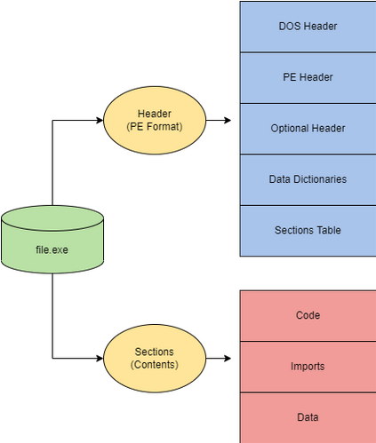
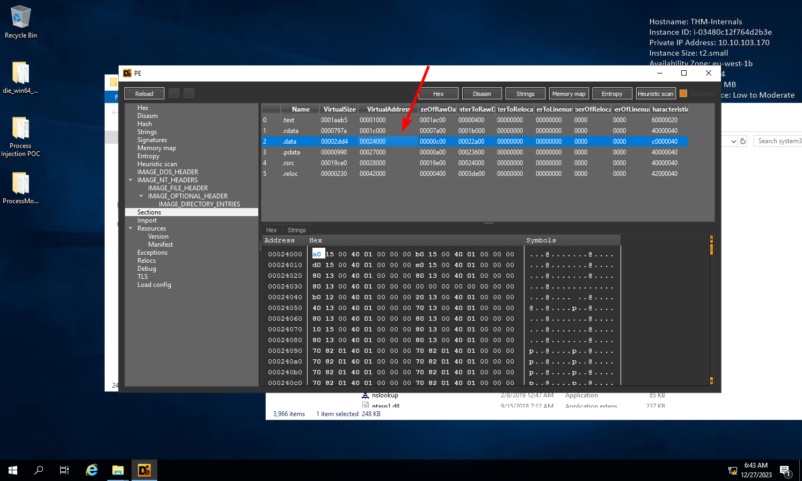

# Windows Internals - Windows 内部机制

> [TryHackMe | Windows Internals](https://tryhackme.com/room/windowsinternals)
>
> Updated in 2023-12-24
>
> 学习并理解 Windows 在其核心运行的基本原理。
>
> Learn and understand the fundamentals of how Windows operates at its core.

## Introduction

操作系统背后的技术和架构远比我们一开始看到的要复杂得多。在这个空间里，我们将观察 Windows 操作系统和常见的内部组件。

### 学习目标

- 理解并与 Windows 进程及其基础技术进行交互。
- 学习核心文件格式及其用途。
- 与 Windows 内部交互，了解 Windows 内核的运作方式。

由于 Windows 机器构成了大部分企业基础架构，红队需要了解 Windows 内部机制以及如何进行滥用。红队可以在制作攻击性工具或漏洞利用时利用 Windows 进行规避和利用。

在开始这个空间之前，请熟悉基本的 Windows 使用和功能。建议但不强制要求具备 C++ 和 PowerShell 的基本编程知识。

我们提供了一个基础的 Windows 机器，并提供了完成这个空间所需的文件。您可以通过浏览器访问该机器，也可以使用以下凭据通过 RDP 进行访问。

```plaintext
Machine IP: 10.10.49.92
Username: THM-Attacker
Password: Tryhackme!
```

## Processes - 进程

一个进程维护和表示程序的执行；一个应用程序可以包含一个或多个进程。进程有许多组件，它们被拆分并存储以便进行交互。微软文档 [About Processes and Threads - Microsoft Learn](https://learn.microsoft.com/en-us/windows/win32/procthread/about-processes-and-threads) 将这些其他组件分解为：

:::info

每个进程提供执行程序所需的资源。一个进程具有虚拟地址空间、可执行代码、对系统对象的打开句柄、安全上下文、唯一的进程标识符、环境变量、优先级类、最小和最大工作集大小，以及至少一个执行线程。

:::

这些信息可能看起来令人望而生畏，但这个空间旨在让这个概念变得稍微简单一些。

如前所述，进程是由应用程序的执行而创建的。进程是 Windows 运行的核心，Windows 的大多数功能都可以被包括在一个应用程序中，并具有相应的进程。以下是一些启动进程的默认应用程序示例。

- MsMpEng (Microsoft Defender)
- wininit (键盘和鼠标)
- lsass (凭据存储)

攻击者可以针对进程进行攻击，以规避检测并将恶意软件隐藏为合法进程。以下是攻击者可能针对进程采用的一些潜在攻击向量：

- 进程注入（[T1055](https://attack.mitre.org/techniques/T1055/)）
- 进程空壳化（[T1055.012](https://attack.mitre.org/techniques/T1055/012/)）
- 进程伪装（[T1055.013](https://attack.mitre.org/techniques/T1055/013/)）

进程具有许多组件；它们可以被分成关键特征，我们可以用这些特征来高层次地描述进程。下表描述了进程的每个关键组件及其用途。

|     进程组件     |                       目的                       |
| :--------------: | :----------------------------------------------: |
| 私有虚拟地址空间 |             进程被分配的虚拟内存地址             |
|    可执行程序    |       定义存储在虚拟地址空间中的代码和数据       |
|     打开句柄     |          定义进程可以访问的系统资源句柄          |
|    安全上下文    | 访问令牌定义了用户、安全组、特权以及其他安全信息 |
|    进程标识符    |               进程的唯一数字标识符               |
|       线程       |              进程中被调度执行的部分              |

我们也可以从更低的层次解释进程，因为它存在于虚拟地址空间中。下面的表格和图表描述了进程在内存中的样子

|   组件   |          用途          |
| :------: | :--------------------: |
|   代码   |    进程要执行的代码    |
| 全局变量 |       存储的变量       |
|  进程堆  |    定义数据存储的堆    |
| 进程资源 |   定义进程的其他资源   |
|  环境块  | 定义进程信息的数据结构 |

<div style={{textAlign:'center'}}>


</div>

这些信息在深入探讨漏洞利用和滥用基础技术时非常有用，但它们仍然非常抽象。我们可以通过在 Windows 任务管理器中观察进程来使其更加具体。任务管理器可以报告有关进程的许多组件和信息。以下是一个简要列出的重要进程详细信息表

| 数值 / 组件 |                  用途                  |    示例     |
| :---------: | :------------------------------------: | :---------: |
|    名称     | 定义进程的名称，通常从应用程序继承而来 | conhost.exe |
|     PID     |       唯一的数字值，用于识别进程       |    7408     |
|    状态     |  确定进程的运行状态（运行中、挂起等）  |   运行中    |
|   用户名    |   启动进程的用户。可以表示进程的权限   |   SYSTEM    |

作为最终用户，你会与这些东西进行互动，作为攻击者，你会操纵它们。

有多种实用工具可以帮助观察进程，包括 [Process Hacker 2](https://github.com/processhacker/processhacker) [、Process Explorer](https://docs.microsoft.com/en-us/sysinternals/downloads/process-explorer) 和 [Procmon](https://docs.microsoft.com/en-us/sysinternals/downloads/procmon)

进程是大多数内部 Windows 组件的核心。以下任务将扩展关于进程及其在 Windows 中的使用的信息。

:::info Answer the questions below

“notepad.exe” 的进程 ID 是多少？

<details>

<summary> 具体操作步骤 </summary>

在 `Procmon` 中，可以增加筛选器，对 `notepad` 这个字符串进行筛选


就可以得到 `notepad.exe` 的相关信息


</details>

```plaintext
5984
```

前一个进程的父进程 ID 是多少？

<details>

<summary> 具体操作步骤 </summary>

在 `notepad.exe` 的属性中就可以得到


</details>

```plaintext
3412
```

该进程的完整性级别是多少？

<details>

<summary> 具体操作步骤 </summary>

看上一题的截图就可以得到

</details>

```plaintext
High
```

:::

## Threads - 线程

线程是由进程使用的可执行单元，并根据设备因素进行调度。

设备因素可以根据 CPU 和内存规格、优先级和逻辑因素等而变化。

我们可以简化线程的定义为：“控制进程执行。”

由于线程控制执行，这是一个常被攻击的组件。线程滥用可单独用于辅助代码执行，或更广泛地与其他 API 调用链接，作为其他技术的一部分。

线程与其父进程共享相同的详细信息和资源，例如代码、全局变量等。线程也具有其独特的值和数据，如下表所述。

|     组件     |                      目的                      |
| :----------: | :--------------------------------------------: |
|      栈      | 所有与线程相关和特定的数据（异常、过程调用等） |
| 线程本地存储 |         为分配存储到独特数据环境的指针         |
|    栈参数    |             分配给每个线程的唯一值             |
|  上下文结构  |          保存由内核维护的机器寄存器值          |

线程可能看起来简单朴素，但它们的功能对进程至关重要。

:::info Answer the questions below

“notepad.exe” 创建的第一个线程的线程 ID 是多少？

<details>

<summary> 具体操作步骤 </summary>

筛选 `Thread Create` 的操作


第一个创建的线程就是所需要的


</details>

```plaintext
5908
```

前一个线程的栈参数是什么？

<details>

<summary> 具体操作步骤 </summary>

查看筛选后的结果，第一个线程就是所需要的


</details>

```plaintext
6584
```

:::

## Virtual Memory - 虚拟内存

虚拟内存是 Windows 内部工作及其相互交互的关键组件。虚拟内存允许其他内部组件以类似于物理内存的方式与内存交互，而不会出现应用程序之间的冲突风险。模式和冲突的概念在第 8 个任务中有进一步解释。

虚拟内存为每个进程提供了私有的虚拟地址空间，参考 [Virtual Address Space (Memory Management) - Microsoft Learn](https://learn.microsoft.com/en-us/windows/win32/memory/virtual-address-space) 。内存管理器用于将虚拟地址转换为物理地址。通过拥有私有的虚拟地址空间，而不是直接写入物理内存，进程减少了造成损坏的风险。

内存管理器还会使用页面或转移来处理内存。应用程序可能会使用比分配的物理内存更多的虚拟内存；内存管理器会将虚拟内存传输或分页到磁盘以解决这个问题。您可以在下面的图表中看到这个概念。

<div style={{textAlign:'center'}}>


</div>

在 32 位 x86 系统上，理论上的最大虚拟地址空间是 4 GB。

这个地址空间被分成两半，低半部分（0x00000000 - 0x7FFFFFFF）分配给进程，如上所述。高半部分（0x80000000 - 0xFFFFFFFF）分配给操作系统内存利用。管理员可以通过设置（increaseUserVA）或使用 AWE（Address Windowing Extensions）来改变这种分配布局，以满足需要更大地址空间的应用程序。

在 64 位现代系统上，理论上的最大虚拟地址空间是 256 TB。

确切的地址布局比例从 32 位系统分配到 64 位系统。

大多数需要设置或使用 AWE [Address Windowing Extensions - Microsoft Learn](https://learn.microsoft.com/en-us/windows/win32/memory/address-windowing-extensions) 的问题都可以通过增加理论上的最大值来解决。

您可以在下方的图示中可视化两种地址空间分配布局。

<div style={{textAlign:'center'}}>


</div>

虽然这个概念不直接对应于 Windows 内部或概念，但理解它至关重要。如果正确理解，它可以帮助滥用 Windows 内部。

:::info Answer the questions below

32 位 x86 系统的理论最大虚拟地址空间是多少？

```plaintext
4 GB
```

可以用哪个默认设置标志来重新分配用户进程的地址空间？

```plaintext
increaseUserVA
```

“notepad.exe” 的基地址是多少？

<details>

<summary> 具体操作步骤 </summary>

在筛选器中，添加两个条件，对进程名字和操作进行筛选


对第一条日志，查看具体信息


即可得到基地址

</details>

```plaintext
0x7ff652ec0000
```

:::

## Dynamic Link Libraries - 动态链接库

Microsoft 文档 [What is a DLL - Microsoft Learn](https://learn.microsoft.com/en-us/troubleshoot/windows-client/deployment/dynamic-link-library#:~:text=A%20DLL%20is%20a%20library,common%20dialog%20box%20related%20functions.) 将 DLL 描述为 “一个包含代码和数据的库，可供多个程序同时使用”。

DLL 作为 Windows 应用程序执行背后的核心功能之一。根据 Windows 文档 [What is a DLL - Microsoft Learn](https://learn.microsoft.com/en-us/troubleshoot/windows-client/deployment/dynamic-link-library#:~:text=A%20DLL%20is%20a%20library,common%20dialog%20box%20related%20functions.) ，“使用 DLL 有助于促进代码的模块化、代码重用、高效的内存使用以及减少磁盘空间。因此，操作系统和程序加载更快，运行更快，并且在计算机上占用更少的磁盘空间。”

当一个 DLL 作为程序中的一个函数被加载时，该 DLL 被指定为依赖项。由于程序依赖于 DLL，攻击者可以针对 DLL 而不是应用程序，来控制执行或功能的某些方面。

- DLL 劫持（[T1574.001](https://attack.mitre.org/techniques/T1574/001/)）
- DLL 侧加载（[T1574.002](https://attack.mitre.org/techniques/T1574/002/)）
- DLL 注入（[T1055.001](https://attack.mitre.org/techniques/T1055/001/)）

创建 DLL 与任何其他项目 / 应用程序没有太大区别；它们只需要稍微修改语法即可。以下是来自 Visual C++ Win32 Dynamic-Link Library 项目的 DLL 示例。

```c
#include "stdafx.h"
#define EXPORTING_DLL
#include "sampleDLL.h"
BOOL APIENTRY DllMain( HANDLE hModule, DWORD ul_reason_for_call, LPVOID lpReserved
)
{
    return TRUE;
}

void HelloWorld()
{
    MessageBox(NULL, TEXT("Hello World"), TEXT("In a DLL"), MB_OK);
}
```

以下是 DLL 的头文件；它将定义要导入和导出的函数。在任务的下一部分，我们将讨论头文件的重要性（或缺乏重要性）。

```c
#ifndef INDLL_H
    #define INDLL_H
    #ifdef EXPORTING_DLL
        extern __declspec(dllexport) void HelloWorld();
    #else
        extern __declspec(dllimport) void HelloWorld();
    #endif

#endif
```

DLL 已经创建，但问题在于它们如何在应用程序中使用？

DLL 可以使用加载时动态链接或运行时动态链接加载到程序中。

使用加载时动态链接时，应用程序会对 DLL 函数进行显式调用。只有提供了头文件（.h）和导入库（.lib）文件才能实现这种类型的链接。以下是从应用程序调用导出的 DLL 函数的示例。

```c
#include "stdafx.h"
#include "sampleDLL.h"
int APIENTRY WinMain(HINSTANCE hInstance, HINSTANCE hPrevInstance, LPSTR lpCmdLine, int nCmdShow)
{
    HelloWorld();
    return 0;
}
```

使用运行时动态链接时，需要使用单独的函数（`LoadLibrary` 或 `LoadLibraryEx`）来在运行时加载 DLL。一旦加载，需要使用 `GetProcAddress` 来识别要调用的导出 DLL 函数。以下是在应用程序中加载和导入 DLL 函数的示例。

```c
...
typedef VOID (*DLLPROC) (LPTSTR);
...
HINSTANCE hinstDLL;
DLLPROC HelloWorld;
BOOL fFreeDLL;

hinstDLL = LoadLibrary("sampleDLL.dll");
if (hinstDLL != NULL)
{
    HelloWorld = (DLLPROC) GetProcAddress(hinstDLL, "HelloWorld");
    if (HelloWorld != NULL)
        (HelloWorld);
    fFreeDLL = FreeLibrary(hinstDLL);
}
...
```

在恶意代码中，威胁行为者通常会比使用加载时动态链接更多地使用运行时动态链接。这是因为恶意程序可能需要在内存区域之间传输文件，并且传输单个 DLL 比使用其他文件要求更容易管理。

:::info Answer the questions below

“notepad.exe” 加载的 “ntdll.dll” 的基址是多少？

<details>

<summary> 具体操作步骤 </summary>

应用以下筛选器规则


即可得到具体的日志条目

</details>

```plaintext
0x7ffd0be20000
```

“notepad.exe” 加载的 “ntdll.dll” 的大小是多少？

```plaintext
0x1ec000
```

“notepad.exe” 加载了多少个 DLL？

<details>

<summary> 具体操作步骤 </summary>

筛选 `Load Image` 的操作，并筛选为加载 `.dll` 文件的操作


即可得到答案

</details>

```plaintext
51
```

:::

## Portable Executable Format - 可移植可执行文件格式

可执行文件和应用程序是 Windows 内部操作的重要组成部分。PE（可移植可执行文件）格式定义了关于可执行文件和存储数据的信息。PE 格式还定义了数据组件存储结构的方式。

PE（可移植可执行文件）格式是可执行文件和目标文件的总体结构。PE（可移植可执行文件）和 COFF（通用对象文件格式）文件构成了 PE 格式。

<div style={{textAlign:'center'}}>



</div>

PE 数据最常见于可执行文件的十六进制转储。下面我们将分解 calc.exe 的十六进制转储，以了解 PE 数据的各个部分。

PE 数据的结构分为七个组件：

DOS 头部定义文件类型。

MZ DOS 头部将文件格式定义为. exe。下面的十六进制转储部分显示了 DOS 头部。

```plaintext
Offset(h) 00 01 02 03 04 05 06 07 08 09 0A 0B 0C 0D 0E 0F
00000000  4D 5A 90 00 03 00 00 00 04 00 00 00 FF FF 00 00  MZ..........ÿÿ..
00000010  B8 00 00 00 00 00 00 00 40 00 00 00 00 00 00 00  ¸.......@.......
00000020  00 00 00 00 00 00 00 00 00 00 00 00 00 00 00 00  ................
00000030  00 00 00 00 00 00 00 00 00 00 00 00 E8 00 00 00  ............è...
00000040  0E 1F BA 0E 00 B4 09 CD 21 B8 01 4C CD 21 54 68  ..º..´.Í!¸.LÍ!Th
```

DOS Stub 是一个默认在文件开头运行的程序，它打印一个兼容性消息。对于大多数用户来说，这并不影响文件的任何功能。

DOS Stub 打印消息 “This program cannot be run in DOS mode.” DOS Stub 可以在下面的十六进制转储部分看到。

```plaintext
00000040  0E 1F BA 0E 00 B4 09 CD 21 B8 01 4C CD 21 54 68  ..º..´.Í!¸.LÍ!Th
00000050  69 73 20 70 72 6F 67 72 61 6D 20 63 61 6E 6E 6F  is program canno
00000060  74 20 62 65 20 72 75 6E 20 69 6E 20 44 4F 53 20  t be run in DOS
00000070  6D 6F 64 65 2E 0D 0D 0A 24 00 00 00 00 00 00 00  mode....$.......
```

PE 文件头提供了二进制文件的 PE 头信息。它定义了文件的格式，包含了签名和图像文件头以及其他信息头。

PE 文件头是人类最难理解的部分之一。你可以从下面的十六进制转储部分中 PE 存根的位置开始识别 PE 文件头。

```plaintext
000000E0  00 00 00 00 00 00 00 00 50 45 00 00 64 86 06 00  ........PE..d†..
000000F0  10 C4 40 03 00 00 00 00 00 00 00 00 F0 00 22 00  .Ä@.........ð.".
00000100  0B 02 0E 14 00 0C 00 00 00 62 00 00 00 00 00 00  .........b......
00000110  70 18 00 00 00 10 00 00 00 00 00 40 01 00 00 00  p..........@....
00000120  00 10 00 00 00 02 00 00 0A 00 00 00 0A 00 00 00  ................
00000130  0A 00 00 00 00 00 00 00 00 B0 00 00 00 04 00 00  .........°......
00000140  63 41 01 00 02 00 60 C1 00 00 08 00 00 00 00 00  cA....`Á........
00000150  00 20 00 00 00 00 00 00 00 00 10 00 00 00 00 00  . ..............
00000160  00 10 00 00 00 00 00 00 00 00 00 00 10 00 00 00  ................
00000170  00 00 00 00 00 00 00 00 94 27 00 00 A0 00 00 00  ........”'.. ...
00000180  00 50 00 00 10 47 00 00 00 40 00 00 F0 00 00 00  .P...G...@..ð...
00000190  00 00 00 00 00 00 00 00 00 A0 00 00 2C 00 00 00  ......... ..,...
000001A0  20 23 00 00 54 00 00 00 00 00 00 00 00 00 00 00   #..T...........
000001B0  00 00 00 00 00 00 00 00 00 00 00 00 00 00 00 00  ................
000001C0  10 20 00 00 18 01 00 00 00 00 00 00 00 00 00 00  . ..............
000001D0  28 21 00 00 40 01 00 00 00 00 00 00 00 00 00 00  (!..@...........
000001E0  00 00 00 00 00 00 00 00 00 00 00 00 00 00 00 00  ................
```

图像可选头部的名称有些误导，但它是 PE 文件头的重要部分。

数据字典是图像可选头部的一部分，它们指向图像数据目录结构。

节表将定义图像中可用的各个节以及其中的信息。如前所述，各个节存储文件的内容，例如代码、导入表和数据。你可以从下面的十六进制转储部分的表格中识别每个节的定义。

```plaintext
000001F0  2E 74 65 78 74 00 00 00 D0 0B 00 00 00 10 00 00  .text...Ð.......
00000200  00 0C 00 00 00 04 00 00 00 00 00 00 00 00 00 00  ................
00000210  00 00 00 00 20 00 00 60 2E 72 64 61 74 61 00 00  .... ..`.rdata..
00000220  76 0C 00 00 00 20 00 00 00 0E 00 00 00 10 00 00  v.... ..........
00000230  00 00 00 00 00 00 00 00 00 00 00 00 40 00 00 40  ............@..@
00000240  2E 64 61 74 61 00 00 00 B8 06 00 00 00 30 00 00  .data...¸....0..
00000250  00 02 00 00 00 1E 00 00 00 00 00 00 00 00 00 00  ................
00000260  00 00 00 00 40 00 00 C0 2E 70 64 61 74 61 00 00  ....@..À.pdata..
00000270  F0 00 00 00 00 40 00 00 00 02 00 00 00 20 00 00  ð....@....... ..
00000280  00 00 00 00 00 00 00 00 00 00 00 00 40 00 00 40  ............@..@
00000290  2E 72 73 72 63 00 00 00 10 47 00 00 00 50 00 00  .rsrc....G...P..
000002A0  00 48 00 00 00 22 00 00 00 00 00 00 00 00 00 00  .H..."..........
000002B0  00 00 00 00 40 00 00 40 2E 72 65 6C 6F 63 00 00  ....@..@.reloc..
000002C0  2C 00 00 00 00 A0 00 00 00 02 00 00 00 6A 00 00  ,.... .......j..
000002D0  00 00 00 00 00 00 00 00 00 00 00 00 40 00 00 42  ............@..B
```

现在头部已经定义了文件的格式和功能，各个节可以定义文件的内容和数据。

|     Section      |               Purpose                |
| :--------------: | :----------------------------------: |
|      .text       |        包含可执行代码和入口点        |
|      .data       | 包含已初始化的数据（字符串、变量等） |
| .rdata or .idata |    包含导入（Windows API）和 DLL     |
|      .reloc      |            包含重定位信息            |
|      .rsrc       |      包含应用程序资源（图像等）      |
|      .debug      |             包含调试信息             |

:::info Answer the questions below

哪个 PE 组件打印了消息 “This program cannot be run in DOS mode”？

```plaintext
DOS STUB
```

DiE 报告的入口点是什么？

<details>

<summary> 具体操作步骤 </summary>

用 DiE 加载 `notepad.exe` ，即可看到


</details>

```plaintext
000000014001acd0
```

“NumberOfSections” 的值是多少？

```plaintext
0006
```

“.data” 节的虚拟地址是多少？

<details>

<summary> 具体操作步骤 </summary>

进入 `section` 的选项卡，即可看到



</details>

```plaintext
00024000
```

位于偏移量 “0001f99c” 处的字符串是什么？

<details>

<summary> 具体操作步骤 </summary>

进入 `Strings` 的选项卡，即可看到


</details>

```plaintext
Microsoft.Notepad
```

:::

## Interacting with Windows Internals - 与 Windows 内部交互

与 Windows 内部交互可能看起来很复杂，但已经被大大简化。与 Windows 内部交互最可访问和研究的选项是通过 Windows API 调用进行接口交互。Windows API 提供了与 Windows 操作系统交互的原生功能。API 包含 Win32 API 和较少使用的 Win64 API。

在这里，我们只会简要介绍与 Windows 内部相关的几个特定 API 调用的使用。有关 Windows API 的更多信息，请查看 Windows API 的相关资料。

大多数 Windows 内部组件需要与物理硬件和内存交互。

Windows 内核将控制所有程序和进程，并桥接所有软件和硬件交互。这一点特别重要，因为许多 Windows 内部组件在某种形式上需要与内存交互。

默认情况下，应用程序通常无法与内核交互或修改物理硬件，需要一个接口。这个问题通过处理器模式和访问级别来解决。

Windows 处理器有用户模式和内核模式。处理器将根据访问和请求的模式在这些模式之间进行切换。

用户模式和内核模式之间的切换通常由系统和 API 调用来完成。在文档中，这一点有时被称为 “切换点”。

|          User mode           |         Kernel Mode          |
| :--------------------------: | :--------------------------: |
|       没有直接硬件访问       |         直接硬件访问         |
| 在私有虚拟地址空间中创建进程 | 在单个共享虚拟地址空间中运行 |
|     访问 “拥有的内存位置”     |       访问整个物理内存       |

应用程序在用户模式或 “用户空间” 中启动，直到进行系统调用或通过 API 接口为止。当进行系统调用时，应用程序会切换模式。下图是描述这一过程的流程图。

<div style={{textAlign:'center'}}>


</div>

在查看语言与 Win32 API 的交互方式时，这个过程可能会更加复杂；应用程序在通过 API 之前会经过语言运行时。最常见的例子是 C# 在与 Win32 API 交互并进行系统调用之前通过 CLR 执行。

我们将向本地进程注入一个消息框，以演示通过内存进行交互的概念验证。

编写消息框到内存的步骤如下：

1. 为消息框分配本地进程内存。
2. 将消息框写入 / 复制到已分配的内存。
3. 从本地进程内存中执行消息框。

在第一步中，我们可以使用 `OpenProcess` 获取指定进程的句柄。

```c
HANDLE hProcess = OpenProcess(
    PROCESS_ALL_ACCESS, // Defines access rights
    FALSE, // Target handle will not be inhereted
    DWORD(atoi(argv[1])) // Local process supplied by command-line arguments
);
```

在第二步中，我们可以使用 `VirtualAllocEx` 来分配具有有效载荷缓冲区的内存区域。

```c
remoteBuffer = VirtualAllocEx(
    hProcess, // Opened target process
    NULL,
    sizeof payload, // Region size of memory allocation
    (MEM_RESERVE | MEM_COMMIT), // Reserves and commits pages
    PAGE_EXECUTE_READWRITE // Enables execution and read/write access to the commited pages
);
```

在第三步中，我们可以使用 `WriteProcessMemory` 将有效载荷写入到已分配的内存区域中。

```c
WriteProcessMemory(
    hProcess, // Opened target process
    remoteBuffer, // Allocated memory region
    payload, // Data to write
    sizeof payload, // byte size of data
    NULL
);
```

在第四步中，我们可以使用 `CreateRemoteThread` 来执行我们在内存中的有效载荷。

```c
remoteThread = CreateRemoteThread(
    hProcess, // Opened target process
    NULL,
    0, // Default size of the stack
    (LPTHREAD_START_ROUTINE)remoteBuffer, // Pointer to the starting address of the thread
    NULL,
    0, // Ran immediately after creation
    NULL
);
```

:::info Answer the questions below

获取下面可执行文件中的标志

<details>

<summary> 具体操作步骤 </summary>

文件夹内，可以看到程序的源码

```c
#include <stdio.h>
#include <windows.h>

int main()
{

    const char* shellcode = \
        "\xd9\xeb\x9b\xd9\x74\x24\xf4\x31\xd2\xb2\x77\x31\xc9\x64\x8b"
        "\x71\x30\x8b\x76\x0c\x8b\x76\x1c\x8b\x46\x08\x8b\x7e\x20\x8b"
        "\x36\x38\x4f\x18\x75\xf3\x59\x01\xd1\xff\xe1\x60\x8b\x6c\x24"
        "\x24\x8b\x45\x3c\x8b\x54\x28\x78\x01\xea\x8b\x4a\x18\x8b\x5a"
        "\x20\x01\xeb\xe3\x34\x49\x8b\x34\x8b\x01\xee\x31\xff\x31\xc0"
        "\xfc\xac\x84\xc0\x74\x07\xc1\xcf\x0d\x01\xc7\xeb\xf4\x3b\x7c"
        "\x24\x28\x75\xe1\x8b\x5a\x24\x01\xeb\x66\x8b\x0c\x4b\x8b\x5a"
        "\x1c\x01\xeb\x8b\x04\x8b\x01\xe8\x89\x44\x24\x1c\x61\xc3\xb2"
        "\x08\x29\xd4\x89\xe5\x89\xc2\x68\x8e\x4e\x0e\xec\x52\xe8\x9f"
        "\xff\xff\xff\x89\x45\x04\xbb\x7e\xd8\xe2\x73\x87\x1c\x24\x52"
        "\xe8\x8e\xff\xff\xff\x89\x45\x08\x68\x6c\x6c\x20\x41\x68\x33"
        "\x32\x2e\x64\x68\x75\x73\x65\x72\x30\xdb\x88\x5c\x24\x0a\x89"
        "\xe6\x56\xff\x55\x04\x89\xc2\x50\xbb\xa8\xa2\x4d\xbc\x87\x1c"
        "\x24\x52\xe8\x5f\xff\xff\xff\x68\x6f\x78\x58\x20\x68\x61\x67"
        "\x65\x42\x68\x4d\x65\x73\x73\x31\xdb\x88\x5c\x24\x0a\x89\xe3"
        "\x68\x32\x7d\x58\x20\x68\x68\x31\x4e\x47\x68\x48\x33\x5f\x37"
        "\x68\x6c\x4c\x5f\x37\x68\x63\x37\x5f\x34\x68\x31\x4e\x6a\x33"
        "\x68\x54\x48\x4d\x7b\x31\xc9\x88\x4c\x24\x1a\x89\xe1\x31\xd2"
        "\x52\x53\x51\x52\xff\xd0\x31\xc0\x50\xff\x55\x08";

    printf("shellcode length: %i", strlen(shellcode));

    LPVOID lpAlloc = VirtualAlloc(0, 4096, MEM_COMMIT, PAGE_EXECUTE_READWRITE);
    memcpy(lpAlloc, shellcode, strlen(shellcode));

    ((void(*)())lpAlloc)();

    return 0;
}
```

将 shellcode 提取出来

```c
    \xd9\xeb\x9b\xd9\x74\x24\xf4\x31\xd2\xb2\x77\x31\xc9\x64\x8b\x71\x30\x8b\x76\x0c\x8b\x76\x1c\x8b\x46\x08\x8b\x7e\x20\x8b\x36\x38\x4f\x18\x75\xf3\x59\x01\xd1\xff\xe1\x60\x8b\x6c\x24\x24\x8b\x45\x3c\x8b\x54\x28\x78\x01\xea\x8b\x4a\x18\x8b\x5a\x20\x01\xeb\xe3\x34\x49\x8b\x34\x8b\x01\xee\x31\xff\x31\xc0\xfc\xac\x84\xc0\x74\x07\xc1\xcf\x0d\x01\xc7\xeb\xf4\x3b\x7c\x24\x28\x75\xe1\x8b\x5a\x24\x01\xeb\x66\x8b\x0c\x4b\x8b\x5a\x1c\x01\xeb\x8b\x04\x8b\x01\xe8\x89\x44\x24\x1c\x61\xc3\xb2\x08\x29\xd4\x89\xe5\x89\xc2\x68\x8e\x4e\x0e\xec\x52\xe8\x9f\xff\xff\xff\x89\x45\x04\xbb\x7e\xd8\xe2\x73\x87\x1c\x24\x52\xe8\x8e\xff\xff\xff\x89\x45\x08\x68\x6c\x6c\x20\x41\x68\x33\x32\x2e\x64\x68\x75\x73\x65\x72\x30\xdb\x88\x5c\x24\x0a\x89\xe6\x56\xff\x55\x04\x89\xc2\x50\xbb\xa8\xa2\x4d\xbc\x87\x1c\x24\x52\xe8\x5f\xff\xff\xff\x68\x6f\x78\x58\x20\x68\x61\x67\x65\x42\x68\x4d\x65\x73\x73\x31\xdb\x88\x5c\x24\x0a\x89\xe3\x68\x32\x7d\x58\x20\x68\x68\x31\x4e\x47\x68\x48\x33\x5f\x37\x68\x6c\x4c\x5f\x37\x68\x63\x37\x5f\x34\x68\x31\x4e\x6a\x33\x68\x54\x48\x4d\x7b\x31\xc9\x88\x4c\x24\x1a\x89\xe1\x31\xd2\x52\x53\x51\x52\xff\xd0\x31\xc0\x50\xff\x55\x08
```

使用 Cutter 进行反汇编

<div style={{textAlign:'center'}}>


</div>

在反编译选项卡中，可以看到 Messagebox 的相关调用


可以使用 Python 脚本进行解码

```python
hex_datas = ["0x7b4d4854", "0x336a4e31", "0x345f3763", "0x375f4c6c", "0x375f3348", "0x474e3168", "0x20587d32"]
res = ""
for hex_data in hex_datas:
    print(hex_data[2:], end="-->")
    hex_string = hex_data[2:]
    decoded_text = bytes.fromhex(hex_string).decode("utf-8")[::-1]
    print(decoded_text)
    res += decoded_text
print(res)
```

</details>

```plaintext
THM{1Nj3c7_4lL_7H3_7h1NG2}
```

:::

## Conclusion

Windows 内部机制是 Windows 操作系统运作的核心。这些内部机制若发生变化，就会损害操作系统在基础层面的运作方式。因此，Windows 内部机制成为攻击者值得攻击的目标。

正如房间中多次提到的那样，攻击者可以轻易地滥用 Windows 内部组件的功能来进行恶意行为。欲了解更多信息，请查看《滥用 Windows 内部机制》房间。

这个房间涵盖的许多概念甚至可以转化为 Unix 对应的部分。虽然攻击的具体细节和执行方式可能会有所不同，但很多核心概念保持不变。

总的来说，Windows 内部机制是不可或缺的；红队和蓝队都需要了解其能力，包括使用方法和原因。
